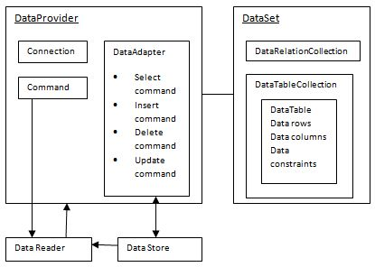
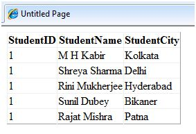

# ADO.NET 

ADO.NET 提供了前端控件和后端数据库之间的桥梁。ADO.NET 对象封装了与进行数据显示对象相互作用的所有数据存取操作和控件。因此便隐藏了数据移动的细节。  

下列图表整体展示了 ADO.NET 对象： 

  

## DataSet 类

数据集代表了数据库的一个子集。它和数据库没有持续的连接。为了升级数据库需要进行重新连接。DataSet 包括了 DataTable 和 DataRelation 对象。DataRelation 对象代表了两张表之间的关系。  

下表是 DataSet 类的一些重要属性：  

|**属性**   | **描述**|  
|:---------|:------------|  
|CaseSensitive|说明和数据表进行对比的字符串是否区分大小写。|  
|Container|为组件获取空间。|  
|DataSetName|获取或者设置现有数据集合的名称。|  
|DefaultViewManager|返回数据集合中的数据视图。|  
|DesignMode|表明组件是否处于设计模式下。|  
|EnforceConstraints|表明尝试上传文件时是否遵循限制条件。|  
|Events|获取与本组件相关的事件处理器列表。|  
|ExtendedProperties|获取与 DataSet 相关的自定义用户的信息的集合。|  
|HasErrors|表明是否有任何错误。|  
|IsInitialized|表明 DataSet 是否初始化。|  
|Locale|获取或者设置用来和表比较字符串的信息。|  
|Namespace|获取或者设置 DataSet 的命名空间。|  
|Prefix|获取或者设置一个 XML 前缀，它是命名空间的别名。|  
|Relations|返回 DataRelation 对象的集合。|  
|Tables|返回 DataTable 对象的集合。|

下表列出来 DataSet 类的一些重要方法：  

|**方法**   | **描述**         |  
|:---------|:------------|  
|AcceptChanges|接受所有由于装载 DataSet 或者这个方法的更改。|  
|BeginInit|开始 DataSet 的初始化。该初始化发生在运行时。|  
|Clear|清除数据。|  
|Clone|克隆包括所有 DataTable 的结构、关系和限制在内的 DataSet 的结构。但是不克隆数据。|  
|Copy|复制数据和结构。|  
|CreateDataReader()|为每个 DataTable 返回带有一个结果集的 DataTableReader，顺序与 Tables 集合中表的显示顺序相同。|  
|CreateDataReader(DataTable[])|为每个 DataTable 返回带有一个结果集 DataTableReader。|  
|EndInit|结束在窗体上使用或由另一个组件使用的 DataSet 的初始化。初始化发生在运行时。|  
|Equals(Object)|确定指定的对象是否等于当前对象。|  
|Finalize|释放资源执行其他清除。|  
|GetChanges|获取 DataSet 的副本，该副本包含自加载以来或自上次调用 AcceptChanges 以来对该数据集进行的所有更改。|  
|GetChanges(DataRowState)|获取由 DataRowState 筛选的 DataSet 的副本，该副本包含上次加载以来或调用 AcceptChanges 以来对该数据集进行的所有更改。|  
|GetDataSetSchema|为 DataSet 获取 XmlSchemaSet 副本。|  
|GetObjectData|用序列化 DataSet 所需的数据填充序列化信息对象。|  
|GetType|获取当前实例的 Type。|  
|GetXML|返回存储在 DataSet 中的数据的 XML 表示形式。|  
|GetXMLSchema|返回存储在 DataSet 中的数据的 XML 表示形式的 XML 架构。|  
|HasChanges()|获取一个值，该值指示 DataSet 是否有更改，包括新增行、已删除的行或已修改的行。|  
|HasChanges(DataRowState)|获取一个值，该值指示 DataSet 是否有 DataRowState 被筛选的更改，包括新增行、已删除的行或已修改的行。|  
|IsBinarySerialized|检查 DataSet 的序列化表示形式的格式。|  
|Load(IDataReader, LoadOption, DataTable[])|使用提供的 IDataReader 以数据源的值填充 DataSet，同时使用 DataTable 实例的数组提供架构和命名空间信息。|  
|Load(IDataReader, LoadOption, String[])|使用所提供的 IDataReader，并使用字符串数组为 DataSet 中的表提供名称，从而用来自数据源的值填充 DataSet。|  
|Merge()|将指定的 DataSet、DataTable 或 DataRow 对象的数组合并到当前的 DataSet 或 DataTable 中。这种方法有不同的重载形式。|  
|ReadXML()|将 XML 架构和数据读入 DataSet。这种方法有不同的重载形式。|  
|ReadXMLSchema(0)|将 XML 架构读入 DataSet。这种方法有不同的重载形式。|  
|RejectChanges|回滚自创建 DataSet 以来或上次调用 DataSet.AcceptChanges 以来对其进行的所有更改。|  
|WriteXML()|从 DataSet 写 XML 数据和架构。这种方法有不同的重载形式。|  
|WriteXMLSchema()|从 DataSet 写 XML 架构。这种方法有不同的重载形式。|  

## DataTable 类

DataTable 类代表了数据库中的表。它有如下的重要属性：大多数属性都是只读属性除了 PrimaryKey 属性：  

|**属性**   | **描述**         |  
|:---------|:------------|  
|ChildRelations|获取此 DataTable 的子关系的集合。|  
|Columns|获取属于该表的列的集合。|  
|Constraints|获取由该表维护的约束的集合。|  
|DataSet|获取此表所属的 DataSet。|  
|DefaultView|获取可能包括筛选视图或游标位置的表的自定义视图。|  
|ParentRelations|获取该 DataTable 的父关系的集合。|  
|PrimaryKey|获取或设置充当数据表主键的列的数组。|  
|Rows|获取属于该表的行的集合。|  

下表列示出了一些 DataTable 类的重要方法：  

|**方法**   | **描述**         |  
|:---------|:-----------|  
|AcceptChanges|提交自加载此 DataSet 或上次调用 AcceptChanges 以来对其进行的所有更改。|  
|Clear|通过移除所有表中的所有行来清除任何数据的 DataSet。|  
|GetChanges|获取 DataSet 的副本，该副本包含自上次加载以来或自调用 AcceptChanges 以来对该数据集进行的所有更改。|  
|GetErrors|获取包含错误的 DataRow 对象的数组。|  
|ImportRows|将 DataRow 复制到 DataTable 中，保留任何属性设置以及初始值和当前值。|  
|LoadDataRow|查找和更新特定行。 如果找不到任何匹配行，则使用给定值创建新行。|  
|Merge|将指定的 DataSet、DataTable 或 DataRow 对象的数组合并到当前的 DataSet 或 DataTable 中。|  
|NewRow|创建与该表具有相同架构的新 DataRow。|  
|RejectChanges|回滚自该表加载以来或上次调用 AcceptChanges 以来对该表进行的所有更改。|  
|Reset|清除所有表并从 DataSet 中删除所有关系、外部约束和表。 子类应重写 Reset，以便将 DataSet 还原到其原始状态。|  
|Select|获取 DataRow 对象的数组。|  

## DataRow 类

DataRow 对象代表了表中的一行，它有如下的重要属性：  

|**属性**   | **描述**         |  
|:---------|:----------|  
|HasErrors|表明是否有错误。|  
|Items|获取或者设置存储在特定栏目的数据。|  
|ItemArrays|获取或者设置本行中所有的值。|  
|Table|返回父表。|  

下表列示了 DataRow 类的重要方法：  

|**方法**   | **描述**         |  
|:---------|:------------|  
|AcceptChanges|应用调用该方法后的所有更改。|  
|BeginEdit|开始编辑操作。|  
|CancelEdit|取消编辑操作。|  
|Delete|删除数据行。|  
|EndEdit|结束编辑操作。|  
|GetChildRows|获取本行的子行。|  
|GetParentRow|获取父行。|  
|GetParentRows|获取 DataRow 的父行。|  
|RejectChanges|回滚所有 AcceptChanges 调用后的更改。|  

## DataAdapter 对象

DataAdapter 对象扮演 DataSet 对象与数据库之间的中间者。这有助于 DataSet 从多种数据库或者其他数据源获取数据。 

## DataReader 对象

DataReader 对象是 DataSet 和 DataAdapter 结合的备选。这个对象提供了对数据库中的数据记录的定向的存取。这些对象只适合只读存取，例如填充一个列表然后切断连接。  

## DbCommand 和 DbConnection 对象

DbConnection 对象代表了数据源的连接。这种连接可以在不同的命令对象间共享。  
DbCommand 对象代表了从检索或操纵数据发送到数据库的命令或者或者一个储存的进程。  

## 例子 

目前为止，我们已经应用了我们电脑中的表和数据库。在本案例中，我们将创建一个表，添加栏目，行和数据，并且用 GridView 控件显示表。  

源文件代码如下：  

```
<%@ Page Language="C#" AutoEventWireup="true" CodeBehind="Default.aspx.cs" Inherits="createdatabase._Default" %>

<!DOCTYPE html PUBLIC "-//W3C//DTD XHTML 1.0 Transitional//EN" "http://www.w3.org/TR/xhtml1/DTD/xhtml1-transitional.dtd">

<html xmlns="http://www.w3.org/1999/xhtml" >

   <head runat="server">
      <title>
         Untitled Page
      </title>
   </head>
   
   <body>
      <form id="form1" runat="server">
      
         <div>
            <asp:GridView ID="GridView1" runat="server">
            </asp:GridView>
         </div>
         
      </form>
   </body>
   
</html>
```  

文件的代码如下：  

```
namespace createdatabase
{
   public partial class _Default : System.Web.UI.Page
   {
      protected void Page_Load(object sender, EventArgs e)
      {
         if (!IsPostBack)
         {
            DataSet ds = CreateDataSet();
            GridView1.DataSource = ds.Tables["Student"];
            GridView1.DataBind();
         }
      }
      
      private DataSet CreateDataSet()
      {
         //creating a DataSet object for tables
         DataSet dataset = new DataSet();

         // creating the student table
         DataTable Students = CreateStudentTable();
         dataset.Tables.Add(Students);
         return dataset;
      }
      
      private DataTable CreateStudentTable()
      {
         DataTable Students = new DataTable("Student");

         // adding columns
         AddNewColumn(Students, "System.Int32", "StudentID");
         AddNewColumn(Students, "System.String", "StudentName");
         AddNewColumn(Students, "System.String", "StudentCity");

         // adding rows
         AddNewRow(Students, 1, "M H Kabir", "Kolkata");
         AddNewRow(Students, 1, "Shreya Sharma", "Delhi");
         AddNewRow(Students, 1, "Rini Mukherjee", "Hyderabad");
         AddNewRow(Students, 1, "Sunil Dubey", "Bikaner");
         AddNewRow(Students, 1, "Rajat Mishra", "Patna");

         return Students;
      }

      private void AddNewColumn(DataTable table, string columnType, string  columnName)
      {
         DataColumn column = table.Columns.Add(columnName,  Type.GetType(columnType));
      }

      //adding data into the table
      private void AddNewRow(DataTable table, int id, string name, string city)
      {
         DataRow newrow = table.NewRow();
         newrow["StudentID"] = id;
         newrow["StudentName"] = name;
         newrow["StudentCity"] = city;
         table.Rows.Add(newrow);
      }
   }
}
```  

当你执行程序时，观察以下几方面：

- 程序首先创建应一个数据集合然后用 GridView 控件的 DataBind() 方法约束它。  
- Createdataset() 方法是用户定义功能，它可以创建一个新的 DataSet 对象并且调用其他的用户定义的 CreateStudentTable() 方法来创建表格然后将他们添加到数据集合的表集合中。  
- CreateStudentTable() 方法调用用户定义的 AddNewColumn() 和 AddNewRow() 方法来创建表的栏目和行同时向行中添加数据。  
当页面得到执行，它返回的表的行如下图所示：  


