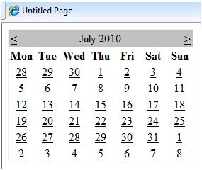
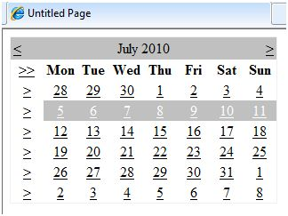
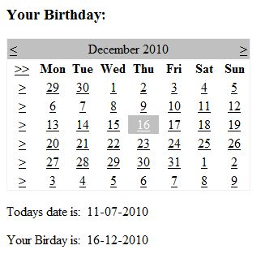

# ASP.NET - 日历

日历控件是一个功能丰富的网络控件，它提供了以下功能：

- 一次显示一个月
- 选择一天，一个星期或一个月
- 选择某范围之内的一天
- 在月份和月份之间移动
- 格式化的控制天数的显示
 
日历控件的基本的语法为：

```
<asp:Calender ID = "Calendar1" runat = "server">
</asp:Calender>
```

## 日历控件的属性和事件

日历控件有很多的属性和事件，使用它们你可以自定义操作并且控制显示。下表提供了日历控件的一些重要的属性：

|**属性**|**描述**|
|:------------- |:-------------| 
|Caption|	获取或设置日历控件的标题。|
|CaptionAlign|获取或设置标题的排列。|
|CellPadding|获取或设置数据和单元格边界之间的空间。|
|CellSpacing|获取或设置单元格之间的空间。|
|DayHeaderStyle|获得样式属性来显示一星期中的一天。|
|DayNameFormat|获取或设置星期中的日期。|
|DayStyle|获取样式属性来显示月份中的日期。|
|FirstDayOfWeek|获取或设置星期中的日期并显示在第一行。|
|NextMonthText|获取或设置下个月的导航文本，默认值是 >。|
|NextPrevFormat|获取或设置下个月或上个月的导航控件。|
|OtherMonthDayStyle|获取没有显示在月份中的日期的样式属性。|
|PrevMonthText|获取或设置上个月的导航文本，默认值是 <。|
|SelectedDate|获取或设置选中的日期。|
|SelectedDates|获取一个 DateTime 对象的集合代表所选日期。|
|SelectedDayStyle|获取选中日期的样式属性。|
|SelectionMode|获取或设置选择模式来指定用户是否可以选择一天，一周或是一个月。|
|SelectMonthText|获取或设置在选择器列中的选择月份元素的文本。|
|SelectorStyle|获取星期或月的选择器列的样式属性。|
|SelectWeekText|获取或设置选择器列中的星期选择元素的文本显示。|
|ShowDayHeader|获取或设置值，该值指示星期中日期的标题是否被显示。|
|ShowGridLines|获取或设置值显示网格线是否会被显示。|
|ShowNextPrevMonth|获取或设置一个值，该值指示下一个月和上一个月的导航元素是否在标题部分显示。|
|ShowTitle|获取或设置一个值，该值指示标题部分是否被显示。|
|TitleFormat|获取或设置标题的格式。|
|Titlestyle|获取日期控件的标题的样式属性。|
|TodayDayStyle|获取今天日期的样式属性。|
|TodaysDate|获取或设置今天的日期的值。|
|UseAccessibleHeader|获取或设置一个值，该值显示是否呈现表格标题 \<th> HTML 元素给日期标头而不是表格数据 \<td> HTML 元素。|
|VisibleDate|获取或设置指定月的日期并显示。|
|WeekendDayStyle|获取或设置周末日期的样式属性。|

日期控件有以下三个最重要的事件来允许开发者编写日期控件。它们是：

|**事件**|**描述**|
|:------------- |:-------------| 
|SelectionChanged|当一天，一周或一个月被选中时，它会被触发。|
|DayRender|日历控件的每一个数据单元呈现时，它会被触发。|
|VisibleMonthChanged|用户更改月份时，它会被触发。|

## 使用日历控件

使用一个没有任何代码的初始的日历控件给网站提供一个有效的日历，以显示一年中的月份和日期。它也含有下个月和上个月的导航。



日历控件允许用户选择一天,一周,或一整个月。这是通过使用 SelectionMode 属性来实现的。这个属性有以下值:

|**属性**|**描述**|
|:------------- |:-------------| 
|Day|选择一天。|
|DayWeek|选择一天或一整个星期。|
|DayWeekMonth|选择一天一星期或一整个月。|
|None|什么也不能被选择。|

选择日期的语法：

```
<asp:Calender ID = "Calendar1" runat = "server" SelectionMode="DayWeekMonth">
</asp:Calender>
```

当选择模式选择为 DayWeekMonth 时，会出现一个用符号 > 标识的额外的列来选择星期，并且 >> 符号出现在天名的左边来选择月份。



## 例子

下面的例子演示了选择一个日期并且显示在一个标签内：

内容文件代码如下：

```
<%@ Page Language="C#" AutoEventWireup="true" CodeBehind="Default.aspx.cs" Inherits="calendardemo._Default" %>

<!DOCTYPE html PUBLIC "-//W3C//DTD XHTML 1.0 Transitional//EN" "http://www.w3.org/TR/xhtml1/DTD/xhtml1-transitional.dtd">

<html xmlns="http://www.w3.org/1999/xhtml" >

   <head runat="server">
      <title>
         Untitled Page
      </title>
   </head>
   
   <body>
      <form id="form1" runat="server">
      
         <div>
            <h3> Your Birthday:</h3>
            <asp:Calendar ID="Calendar1" runat="server  SelectionMode="DayWeekMonth" onselectionchanged="Calendar1_SelectionChanged">
            </asp:Calendar>
         </div>
         
         <p>Todays date is: 
            <asp:Label ID="lblday" runat="server"></asp:Label>
         </p>
         
         <p>Your Birday is: 
            <asp:Label ID="lblbday" runat="server"></asp:Label>
         </p>
         
      </form>
   </body>
</html>
```

事件处理程序的事件 SelectionChanged:

```
protected void Calendar1_SelectionChanged(object sender, EventArgs e)
{
   lblday.Text = Calendar1.TodaysDate.ToShortDateString();
   lblbday.Text = Calendar1.SelectedDate.ToShortDateString();
}
```

运行该文件时,它将生成以下输出:


