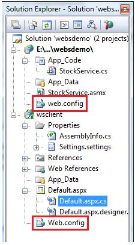

# ASP.NET - 配置  

一个 ASP.NET 应用程序的行为是由以下两个配置文件中的不同设置决定的：  

- machine.config   
- web.config  

machine.config 文件包含所有支持设置项的默认和设置机器的具体值。机器的设置是由系统管理员，且应用程序通常不能访问这个文件。
  
然而，一个应用程序，可以通过它的根文件夹中创建 web.config 文件覆盖默认值。web.config 文件是 machine.config 文件的一个子集。  

如果应用程序包含子目录，那么它可以为每个文件夹定义一个 web.config 文件。每个配置文件的范围是用一个分层的自上而下的方式确定。
  
任何 web.config 文件都可以在本地扩展，限制，或重写任何设置在上层的定义。  

Visual Studio 会为每个项目生成默认的 web.config 文件。应用程序可以在没有 web.config 文件的情况下执行，然而，我们不能调试一个没有 web.config 文件的应用程序。  

下图显示的是用于 web 服务教程中的解决方案资源管理器为样本的例子：  

  

在这种应用中，存在两个 web.config 文件分别对应于调用 web 服务的 web 服务和 web 站点。  

web.config 文件中的配置元素是作为根节点的。此元素中的信息分为两个主要领域：配置节处理程序声明区域，和配置节设置区域。  

下面的代码片段显示了一个配置文件的基本语法：

``` 
    <configuration>
    
       <!-- Configuration section-handler declaration area. -->
          <configSections>
             <section name="section1" type="section1Handler" />
             <section name="section2" type="section2Handler" />
          </configSections>
       <!-- Configuration section settings area. -->
       
       <section1>
          <s1Setting1 attribute1="attr1" />
       </section1>
       
       <section2>
          <s2Setting1 attribute1="attr1" />
       </section2>
       
       <system.web>
          <authentication mode="Windows" />
       </system.web>
       
    </configuration>
``` 
   
## Configuration Section Handler 声明

配置节处理程序声明是包含在 <configSections> 的标签中的，每个配置处理程序指定配置节的名称，并包含在提供了一些配置数据的文件中。它具有以下基本语法：

``` 
    <configSections>
       <section />
       <sectionGroup />
       <remove />
       <clear/>
    </configSections>
``` 

它具有以下元素：  

- **Clear**  - 所有涉及继承的节和节组的引用。
- **Remove** - 删除一个继承引用的部分和部分组。  
- **Section** - 定义了配置节处理程序和配置元素之间的关联。  
- **Section group** - 它定义了一个配置节处理程序与配置节之间的关联。

## 应用程序设置

应用程序设置允许存储只读访问的应用程序的名称-数值对。例如，你可以定义一个自定义应用程序设置如下：  

``` 
    <configuration>
       <appSettings>
          <add key="Application Name" value="MyApplication" /> 
       </appSettings>
    </configuration>
``` 

例如，你还可存储一本书的 ISBN 号和名字数据对：

``` 
    <configuration>
       <appSettings>
          <add key="appISBN" value="0-273-68726-3" />
          <add key="appBook" value="Corporate Finance" />
       </appSettings>
    </configuration>
``` 

## 连接字符串

连接字符串展示的是可用于网站的数据库连接字符串。例如：

``` 
    <connectionStrings>
       <add name="ASPDotNetStepByStepConnectionString" 
          connectionString="Provider=Microsoft.Jet.OLEDB.4.0;
          Data Source=E:\\projects\datacaching\ /
          datacaching\App_Data\ASPDotNetStepByStep.mdb"
          providerName="System.Data.OleDb" />
      
       <add name="booksConnectionString" 
          connectionString="Provider=Microsoft.Jet.OLEDB.4.0;
          Data Source=C:\ \databinding\App_Data\books.mdb"
          providerName="System.Data.OleDb" />
    </connectionStrings>
``` 

## 系统的网络元素

system.web 元素为 ASP.NET 配置节指定了根元素，并且包含了配置 ASP.NET Web 应用程序和控制应用程序运转的配置元素。  

它控制大多数比较常见的需要调整的配置元素。该元素的基本语法如下：

``` 
    <system.web> 
       <anonymousIdentification> 
       <authentication> 
       <authorization> 
       <browserCaps> 
       <caching> 
       <clientTarget> 
       <compilation> 
       <customErrors> 
       <deployment> 
       <deviceFilters> 
       <globalization> 
       <healthMonitoring> 
       <hostingEnvironment> 
       <httpCookies> 
       <httpHandlers> 
       <httpModules> 
       <httpRuntime> 
       <identity> 
       <machineKey> 
       <membership> 
       <mobileControls> 
       <pages> 
       <processModel> 
       <profile> 
       <roleManager> 
       <securityPolicy> 
       <sessionPageState> 
       <sessionState> 
       <siteMap> 
       <trace> 
       <trust> 
       <urlMappings> 
       <webControls> 
       <webParts> 
       <webServices> 
       <xhtmlConformance> 
    </system.web>
``` 

下表提供了一些常用的 **system.web** 元素的子元素的简要描述：  

### AnonymousIdentification

这是在需要用户身份确认时对未被认证的用户进行识别的。

### Authentication

它是配置授权支持的，基本的语法是：  

``` 
    <authorization> 
       <allow .../>
       <deny .../>
    </authorization>
``` 

### Caching

它配置缓存设置，基本的语法是：

``` 
    <caching>
       <cache>...</cache>
       <outputCache>...</outputCache>
       <outputCacheSettings>...</outputCacheSettings>
       <sqlCacheDependency>...</sqlCacheDependency>
    </caching>
``` 

### CustomErrors

它定义了自定义错误消息，基本的语法是：

``` 
    <customErrors defaultRedirect="url" mode="On|Off|RemoteOnly">
       <error. . ./>
    </customErrors>
``` 

### Deployment

它定义了用于部署的配置设置。基本语法如下：

``` 
    <deployment retail="true|false" />
``` 

### HostingEnvironment

它为托管环境定义了配置设置。基本语法如下：

``` 
    <hostingEnvironment idleTimeout="HH:MM:SS" shadowCopyBinAssemblies="true|false" 
       shutdownTimeout="number" urlMetadataSlidingExpiration="HH:MM:SS" />
``` 

### Identity

它用于配置对应用程序的认证机制，基本语法如下:

``` 
    <identity impersonate="true|false" userName="domain\username"
       password="<secure password>"/>
``` 

### MachineKey

它用于配置用于加密和解密数据的表单验证 Cookie 的密钥。  

它还允许配置验证密钥对视图状态数据和 Forms 身份验证票证执行消息认证检查。基本的语法是： 
``` 

    <machineKey validationKey="AutoGenerate,IsolateApps" [String]
       decryptionKey="AutoGenerate,IsolateApps" [String]
       validation="HMACSHA256" [SHA1 | MD5 | 3DES | AES | HMACSHA256 | 
       HMACSHA384 | HMACSHA512 | alg:algorithm_name]
       decryption="Auto" [Auto | DES | 3DES | AES | alg:algorithm_name]
    />
```   
 
### Membership

它用于配置管理和认证用户参数。基本的语法是：

``` 
    <membership defaultProvider="provider name"
       userIsOnlineTimeWindow="number of minutes" hashAlgorithmType="SHA1">
       <providers>...</providers>
    </membership>
```   

### Pages

它提供了网页的具体配置。基本的语法是：  

```    
    <pages asyncTimeout="number" autoEventWireup="[True|False]"
         buffer="[True|False]" clientIDMode="[AutoID|Predictable|Static]"
         compilationMode="[Always|Auto|Never]" 
         controlRenderingCompatibilityVersion="[3.5|4.0]"
         enableEventValidation="[True|False]"
         enableSessionState="[True|False|ReadOnly]"
         enableViewState="[True|False]"
         enableViewStateMac="[True|False]"
         maintainScrollPositionOnPostBack="[True|False]" 
         masterPageFile="file path" 
         maxPageStateFieldLength="number" 
         pageBaseType="typename, assembly"
         pageParserFilterType="string" 
         smartNavigation="[True|False]"
         styleSheetTheme="string"
         theme="string"
         userControlBaseType="typename"
         validateRequest="[True|False]"
         viewStateEncryptionMode="[Always|Auto|Never]" >
       
       <controls>...</controls>
       <namespaces>...</namespaces>
       <tagMapping>...</tagMapping>
       <ignoreDeviceFilters>...</ignoreDeviceFilters>
    </pages>
``` 

### Profile

它用于配置用户配置文件参数。基本的语法是：

``` 
    <profile enabled="true|false" inherits="fully qualified type reference"
       automaticSaveEnabled="true|false" defaultProvider="provider name">
       
       <properties>...</properties>
       <providers>...</providers>
       
    </profile>
``` 

### RoleManager

为用户角色配置设置信息。基本的语法是：

``` 
    <roleManager cacheRolesInCookie="true|false" cookieName="name"
       cookiePath="/" cookieProtection="All|Encryption|Validation|None"
       cookieRequireSSL="true|false " cookieSlidingExpiration="true|false "
       cookieTimeout="number of minutes" createPersistentCookie="true|false"
       defaultProvider="provider name" domain="cookie domain"> 
       enabled="true|false"
       maxCachedResults="maximum number of role names cached"
       
       <providers>...</providers>
    </roleManager>
``` 

### SecurityPolicy

用于配置安全策略。基本的语法是：

``` 
    <securityPolicy>
       <trustLevel />
    </securityPolicy>
``` 

### UrlMappings

它定义了用于隐藏原始URL的映射，并提供更具用户友好性的的 URL 。基本的语法是：

``` 
    <urlMappings enabled="true|false">
       <add.../>
       <clear />
       <remove.../>
    </urlMappings>
``` 

### WebControls

它提供了对客户端脚本共享位置的名称。基本的语法是：

``` 
    <webControls clientScriptsLocation="String" />
``` 

### WebServices

用于配置 Web 服务。
