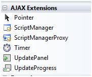
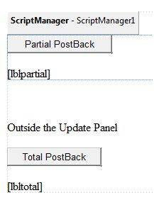
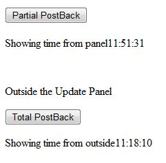

# ASP.NET - Ajax 控制

AJAX 代表  Asynchronous JavaScript and XML。这是一项跨平台的能加速响应时间的技术。AJAX 服务器控件将脚本添加到页面，它由浏览器执行并处理。  

然而像其他 ASP.NET 服务器控件一样，这些 AJAX 服务器控件也能拥有与它们相联系的方法和事件句柄，它们都在服务器端处理。  

在  Visual Studio IDE 里的 control 工具箱含有一组叫作 'AJAX' 的控制组件。  

  

## ScriptManager 控件  

ScriptManager 控件是最重要的控件并且必须出现在页面上以让其他控件工作。  

它有基本语法：  

```
<asp:ScriptManager ID="ScriptManager1" runat="server">
</asp:ScriptManager>
```

如果你创建一个 'Ajax Enabled site' 或者从 'Add Item' 对话框添加一个 'AJAX Web Form'，网页将自动形成，并包含 script manager 控件。ScriptManager 控件为所有的服务器端的控件照顾客户机端的脚本。  

## UpdatePanel 控件  

UpdatePanel 控件是一个容器控件并且源自 Control 类。它作为它里面的子控件的容器而运作并且不拥有它自己的接口。当它其中的一个控件触发提交回来，UpdatePanel 干预异步启动并更新部分页面。  

例如，如果一个 button 控件在 update panel 内，并且它被点击了，只有 update panel 内的控件将被影响，页面其他部分的控件将不会被影响。这被叫做部分提交返回或者异步提交返回。  

### 例子

在你的应用程序中添加一个 AJAX 网页表单。它包含默认的 script manager 控件。插入一个 update panel。将一个 button 控件和一个 label 标签放置在 update panel 控件内。将另一个 button 和 label 集放置在 panel 外。  

设计视图如下所示：  

  

资源文件如下所示：

```
<form id="form1" runat="server">
   <div>
      <asp:ScriptManager ID="ScriptManager1" runat="server" />
   </div>
   
   <asp:UpdatePanel ID="UpdatePanel1" runat="server">
      <ContentTemplate>
         <asp:Button ID="btnpartial" runat="server" onclick="btnpartial_Click" Text="Partial PostBack"/>
         <br />
         <br />
         <asp:Label ID="lblpartial" runat="server"></asp:Label>
      </ContentTemplate>
   </asp:UpdatePanel>
   
   <p> </p>
   <p>Outside the Update Panel</p>
   <p>
      <asp:Button ID="btntotal" runat="server" onclick="btntotal_Click" Text="Total PostBack" />
   </p>
   
   <asp:Label ID="lbltotal" runat="server"></asp:Label>
</form>
```

button 控件对时间处理程序都拥有相同的代码：

```
string time = DateTime.Now.ToLongTimeString();
lblpartial.Text = "Showing time from panel" + time;
lbltotal.Text = "Showing time from outside" + time;
```

观察当页面被执行时，如果总的提交返回按钮被点击了，它将更新标签中都更新时间，但是如果部分提交返回按钮被点击，它仅仅更新在 update panel 内的标签。  

  

### UpdatePanel Control 的属性  

|**属性** |**描述**   |
|:----------|:----------|
|ChildrenAsTriggers|这个属性表示返回是否来自于子控件，这将引起 update panel 的刷新。|
|ContentTemplate|它是内容模板并且定义了当它出现时什么出现在 update panel 内。|
|ContentTemplateContainer|检索动态创建的 template container 对象并被用来以编程方式添加子控件。|
|IsInPartialRendering|指出 panel 是否被更新作为部分提交返回的一部分。|
|RenderMode|展示 render 模式。可用的模式是 Block 和 Inline。|
|UpdateMode|通过确定一些条件来获得或设置 rendering 模式。|
|Triggers|定义 collection trigger 对象，每一个对应于一个引发 panel 自动更新的事件。|  

### UpdatePanel Control 的方法  

以下表格展示了 update panel 控件的方法：  

|**方法** |**描述**   |
|:----------|:----------|
|CreateContentTemplateContainer|创建了一个 Control 对象来作为定义 UpdatePanel 控件内容的子控件的容器。|
|CreateControlCollection|返回所有包含在 UpdatePanel 控件内的控件集合|
|Initialize|如果部分页面绘制被运行的话，初始化 UpdatePanel 控件触发器集合。|
|Update|引起 UpdatePanel 控件内容的更新。|

update panel 的行为依赖于 UpdateMode 属性和 ChildrenAsTriggers 属性的值。  

|**方法** |**描述**   |**影响**|
|:----------|:----------|:--------|
|Always|False|不合法的参数。|
|Always|True|如果整个页面更新或者一个它上面的一个子控件返回，UpdatePanel 更新。|
|Conditional|False|如果整个页面更新或者它外部的一个触发的控件开始一次更新，UpdatePanel 更新。|
|Conditional|True|如果整个页面更新或者一个它上面的一个子控件返回或者一个它外部的触发控件开始一次更新，UpdatePanel 更新。|

## UpdateProgress 控件  

当一个或者更多的 update panel 控件被更新时，UpdateProgress 控件提供了浏览器的一种反馈。例如，当一个用户登录或者当执行一些面向数据库的工作时等待服务器响应。  

它提供了如 "Loading page..." 的视觉确认，表示工作在处理中。  

UpdateProgress 控件的语法是：  

```
<asp:UpdateProgress ID="UpdateProgress1" runat="server" DynamicLayout="true" AssociatedUpdatePanelID="UpdatePanel1" >

   <ProgressTemplate>
      Loading...
   </ProgressTemplate>
   
</asp:UpdateProgress>
```  

以上的片段展示了一个简单的带有 ProgressTemplate 标签的信息。但是，它可以是一张图片或者其他相关的控件。UpdateProgress 控件显示每一个异步的返回，除非它使用 AssociatedUpdatePanelID 属性，被指定为单独的 update panel。  

### UpdateProgress 控件的属性  

以下的表格展示了 update progress 控件的属性。  

|**属性** |**描述**   |
|:----------|:----------|
|AssociatedUpdatePanelID|获得并用这个控件所联系的控件设置 update panel 的 ID。|
|Attributes|获得并设置 UpdateProgress 控件的 cascading style sheet(CSS)属性。|
|DisplayAfter|在处理模板被展示后获得并以毫秒设置时间。默认是 500。|
|DynamicLayout|指示进程模板是否被动态展示。|
|ProgressTemplate|指示模板在一个比 DisplayAfter 时间花了更多时间的异步提交返回的过程中展示。|  

### UpdateProgress 控件的方法  

以下的表格展示了 update progress 控件的方法：  

|**方法** |**描述**   |
|:----------|:----------|
|GetScriptDescriptors|返回一个 UpdateProgress 控件的客户端功能所需要的组件，行为和客户端控件的列表。|
|GetScriptReferences|返回一个客户端脚本依赖 UpdateProgress 控件的列表。|  

## Timer 控件  

timer 控件被用来自动初始化提交返回。这可以用两种方式完成： 

(1)设置 UpdatePanel 控件的 Triggers 属性。  

```
<Triggers> 
   <asp:AsyncPostBackTrigger ControlID="btnpanel2" EventName="Click" />
</Triggers>
```  

(2)直接在 UpdatePanel 内部放置一个 timer 控件来作为一个子控件的触发器。一个单独的 timer 能作为许多 UpdatePanel 的触发器。  

```
<asp:UpdatePanel ID="UpdatePanel1" runat="server" UpdateMode="Always">

   <ContentTemplate>
      <asp:Timer ID="Timer1" runat="server" Interval="1000">
         </asp:Timer>
         
      <asp:Label ID="Label1" runat="server" Height="101px" style="width:304px" >
         </asp:Label>
   </ContentTemplate>
   
</asp:UpdatePanel>
```
