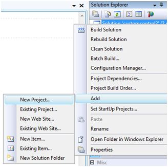

# ASP.NET - 自定义控件  

ASP.NET 允许用户创建控件。这些用户定义的控件被分类为：  

- 用户控件
- 自定义控件  

## 用户控件　　

用户控件行为像微型　ASP.NET 页面或者网页表单，它能被许多其他页面使用。这些都是源自 System.Web.UI.UserControl 类。这些控件有下列特性：  

- 它们有 .ascx 扩展。
- 它们可能不会含有任何 <html>, <body> 或者 <form> 标签。
- 它们有一个 Control 指令而不是一个 Page 指令。  

为了理解这个概念，让我们创建一个简单的用户控件，它将作为 web 页面的页脚使用。为了创建和使用用户控件，采取以下步骤：  

- 创建一个新的 web 应用程序。
- 在 Solution Explorer 上右击项目文件夹并且选择 ADD New Item。

 

- 从 Add New Item 对话框中选择 Web User Control 并且把它命名为 footer.ascx。最初，footer.ascx 仅含有一个 Control 指令。  

```
<%@ Control Language="C#" AutoEventWireup="true" CodeBehind="footer.ascx.cs" 
   Inherits="customcontroldemo.footer" %>
```

- 给文件添加下列代码：  

```
<table>
   <tr>
      <td align="center"> Copyright ©2010 TutorialPoints Ltd.</td>
   </tr>

   <tr>
      <td align="center"> Location: Hyderabad, A.P </td>
   </tr>
</table>
```

为给你的 web 网页添加用户控件，你必须添加 Register 指令和一个页面用户控件的实例。以下的代码展示了说明：  

```
<%@ Page Language="C#" AutoEventWireup="true" CodeBehind="Default.aspx.cs" Inherits="customcontroldemo._Default" %>
   
<%@ Register Src="~/footer.ascx" TagName="footer" TagPrefix="Tfooter" %>

<!DOCTYPE html PUBLIC "-//W3C//DTD XHTML 1.0 Transitional//EN" "http://www.w3.org/TR/xhtml1/DTD/xhtml1-transitional.dtd">

<html xmlns="http://www.w3.org/1999/xhtml" >

   <head runat="server">
      <title>
         Untitled Page
      </title>
   </head>
   
   <body>
   
      <form id="form1" runat="server">
         <div>
         
            <asp:Label ID="Label1" runat="server" Text="Welcome to ASP.Net Tutorials "></asp:Label>
            <br />  <br />
            <asp:Button ID="Button1" runat="server" onclick="Button1_Click"  Text="Copyright Info" />
            
         </div>
         <Tfooter:footer ID="footer1" runat="server" />
      </form>
      
   </body>
</html>
```  

当执行后，页面显示了页脚而且这个控件能在所有你的网站的页面中被使用。  

  

观察以下：  

**(1)**Register 指令为控件指定了一个标签名称和标签前缀。  

```
<%@ Register Src="~/footer.ascx" TagName="footer" TagPrefix="Tfooter" %>
```  

**(2)**下列的标签名称和前缀应该在页面上添加用户控件时被使用:  

```
<Tfooter:footer ID="footer1" runat="server" />
```  

## 自定义控件  

自定义控件被部署为单独的集合。它们被编译成动态链接库(DLL)并且作为任何其他的 ASP.NET 服务控件来使用。它们能被以下方法中的任何一个来创建:  

- 通过从一个存在的控件中获得一个自定义控件。
- 通过联合两个或者更多的存在的控件来组成一个新的自定义控件。
- 通过从基本的控件类中获得。

为了理解这个概念，让我们创建一个自定义类，它将简单地在浏览器上呈现一条短信。为了创建控件，采取以下步骤：  

创建一个新的网站。在 Solution Explorer 中树的顶端右击 solution(不是项目)。  

  

在 New Project 对话框中，从项目模板中选择 ASP.NET Server Control。

  

上面的步骤添加了一个新的项目并且给 solution 创建了一个完整的自定义控件，叫做 ServerControl1。在这个例子中，让我命名 CustomControls 项目。为了使用这个控件，它必须在页面上注册之前作为引用添加到网页中。为了添加引用到已存在的项目中，右击项目(不是 solution)，并且点击 Add Reference。  

从 Add Reference 对话框中的 Projects 标签选择 CustomControl 项目。Solution Explorer 能显示引用。

  

为了在页面上使用控件，在 @Page 指令下添加 Register 指令。  

```
<%@ Register Assembly="CustomControls"  Namespace="CustomControls"  TagPrefix="ccs" %>
```

而且，你可以使用控件，和任何其他控件类似。

```
<form id="form1" runat="server">
   <div>
      <ccs:ServerControl1 runat="server" Text = "I am a Custom Server Control" />
   </div> 
</form>
```

当执行后，控件的 Text 属性被展示在浏览器上，如下所示:  

  

## 使用自定义类  

在之前的例子中，自定义类的 Text 属性值被设置了。当控件被创建时，ASP.NET 默认添加了这个属性。以下控件的文件后的代码揭示了这个。  

```
using System;
using System.Collections.Generic;
using System.ComponentModel;
using System.Linq;
using System.Text;

using System.Web;
using System.Web.UI;
using System.Web.UI.WebControls;

namespace CustomControls
{
   [DefaultProperty("Text")]
   [ToolboxData("<{0}:ServerControl1 runat=server></{0}:ServerControl1 >")]
   
   public class ServerControl1 : WebControl
   {
      [Bindable(true)]
      [Category("Appearance")]
      [DefaultValue("")]
      [Localizable(true)]
      
      public string Text
      {
         get
         {
            String s = (String)ViewState["Text"];
            return ((s == null) ? "[" + this.ID + "]" : s);
         }
         
         set
         {
            ViewState["Text"] = value;
         }
      }
      
      protected override void RenderContents(HtmlTextWriter output)
      {
         output.Write(Text);
      }
   }
}
```  

上述的代码自动生成给一个自定义控件。事件和方法能被添加到 custom control 类中。  

### 例子  

让我们扩展之前的名为 ServerControl1 的自定义控件。让我们给予它一个名为 checkpalindrome 的方法，它将给它权限来检查 palindrome。  

Palindrome 是当颠倒时仍拼写相同的文字/字面值。例如，Malayalam，madam,saras 等。  

扩展自定义控件的代码，它应该看起来如下所示：  

```
using System;
using System.Collections.Generic;
using System.ComponentModel;
using System.Linq;
using System.Text;

using System.Web;
using System.Web.UI;
using System.Web.UI.WebControls;

namespace CustomControls
{
   [DefaultProperty("Text")]
   [ToolboxData("<{0}:ServerControl1 runat=server></{0}:ServerControl1  >")]
   
   public class ServerControl1 : WebControl
   {
      [Bindable(true)]
      [Category("Appearance")]
      [DefaultValue("")]
      [Localizable(true)]
      
      public string Text
      {
         get
         {
            String s = (String)ViewState["Text"];
            return ((s == null) ? "[" + this.ID + "]" : s);
         }
         
         set
         {
            ViewState["Text"] = value;
         }
      }
      
      protected override void RenderContents(HtmlTextWriter output)
      {
         if (this.checkpanlindrome())
         {
            output.Write("This is a palindrome: <br />");
            output.Write("<FONT size=5 color=Blue>");
            output.Write("<B>");
            output.Write(Text);
            output.Write("</B>");
            output.Write("</FONT>");
         }
         else
         {
            output.Write("This is not a palindrome: <br />");
            output.Write("<FONT size=5 color=red>");
            output.Write("<B>");
            output.Write(Text);
            output.Write("</B>");
            output.Write("</FONT>");
         }
      }
      
      protected bool checkpanlindrome()
      {
         if (this.Text != null)
         {
            String str = this.Text;
            String strtoupper = Text.ToUpper();
            char[] rev = strtoupper.ToCharArray();
            Array.Reverse(rev);
            String strrev = new String(rev);
            
            if (strtoupper == strrev)
            {
               return true;
            }
            else
            {
               return false;
            }
         }
         else
         {
            return false;
         }
      }
   }
}
```  

当你改变空间的代码时，你必须通过点击 Build --> Build Solution 来构建方法，这样改变才能反映在你的项目中。给页面添加一个 text box 和一个 button 控件，这样用户才能提供一段 text。当 button 被点击时，它就被用来检查 palindrome。  

```
<form id="form1" runat="server">
   <div>
      Enter a word:
      <br />
      <asp:TextBox ID="TextBox1" runat="server" style="width:198px"> </asp:TextBox>
      
      <br /> <br />
      
      <asp:Button ID="Button1" runat="server onclick="Button1_Click" Text="Check Palindrome" style="width:132px" />
      
      <br /> <br />
      
      <ccs:ServerControl1 ID="ServerControl11" runat="server" Text = "" />
   </div>
</form>
```  

button 的 Click 事件句柄简单地将 text box 中的 text 复制到自定义控件的 text 属性中。  

```
protected void Button1_Click(object sender, EventArgs e)
{
   this.ServerControl11.Text = this.TextBox1.Text;
}
```  

当被执行后，控件成功地检测到了 palindromes。  

  

观察以下:  

**(1)** 当你给自定义控件添加一个引用时，它被添加到 toolbox 并且你可以像其他控件一样从 toolbox 中直接使用它。

  

**(2)**custom control 类的 RenderContents 方法被覆写了，你可以添加你自己的方法和事件。

**(3)**RenderContents 方法采用了 HtmlTextWriter 型的参数，它将对在浏览器上展示负责。
