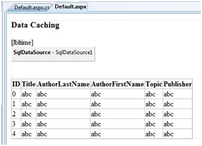

# ASP.NET - 数据缓存  

## 什么是缓存？  

缓存是一种将经常使用的数据/信息存储在内存中的技术,这样,下次需要相同的数据/信息时,可以直接从内存检索,而不是再从应用程序中生成。  

缓存在用于提高 ASP 性能方面是非常重要的，因为 ASP 的页面和控件是都动态生成的。这对于交互相关的数据是极其重要的,因为响应时间是很宝贵的。  

在需要快速访问的媒体，如计算机的随机存取存储器，缓存放置了被频繁使用的数据。ASP 的运行时间包含一个叫做缓存的 CLR 对象的键值对。它位于应用程序内,并且通过 HttpContext 和 System.Web.UI.Page 可用。  

在某些方面，缓存和存储状态对象有相似之处。然而，状态对象的存储信息是确定的，比如，你可以计算存储在状态对象的数据，但是缓存的数据是不确定的。  

在下列情况里，数据是不可用的：  

- 如果它的生命周期已结束，
- 如果该应用释放了它的内存，
- 如果由于某些原因缓存没有被替换。

您可以使用一个索引器在缓存中访问项目,并且有可能控制缓存中对象的生命周期和设置缓存的对象及其物理资源之间的联系。  

## ASP.NET 中的缓存

ASP提供如下几种不同类型的缓存：  

- **输出缓存**：输出缓存可以存储最后显现的网页的副本，或者是发送到客户机的部分页面。下次客户机请求该页面时，这个页面的缓存副本就会被发送给客户机，而不是重新生成这个页面，这样一来就节省了时间。  
- **数据缓存**：数据缓存是指从数据源缓存数据。只要缓存没被替换，那么再请求该数据时就会从缓存中获取。当缓存被替换的时候，会从数据源中获取新数据，缓存也会被再次充满。  
- **对象缓存**：对象缓存是缓存页面的对象，比如数据绑定控件等。缓存的数据放在服务器的内存。  
- **类缓存**：网页或 Web 服务是第一次运行时在组装编译成页类。然后组装会在服务器缓存。当下次请求该页面或者服务,就会使用缓存的装配。当改变源代码时,CLR 重新编译程序集。  
- **配置缓存**：应用程序配置信息存储在一个配置文件。配置缓存存储在服务器内存配置信息。  

在本教程中,我们将考虑输出缓存,数据缓存和对象缓存。  

## 输出缓存

呈现一个页面可能涉及一些复杂的过程,如,数据库访问，呈现复杂的控件等。输出缓存允许通过在内存中缓存数据，而绕过往返服务器。甚至可以缓存整个页面。   

OutputCache 指令负责输出缓存。它启用输出缓存,并对其行为提供一定程度的控制。   

OutputCache 指令的语法：  

```
<%@ OutputCache Duration="15" VaryByParam="None" %>
```

把这个指令放在页面指令下。这告诉环境需要缓存页面,持续 15 秒。以下页面加载事件处理程序将帮助确认页面是否已被缓存完毕。  

```
protected void Page_Load(object sender, EventArgs e)
{
    Thread.Sleep(10000);  
    Response.Write("This page was generated and cache at:" +
    DateTime.Now.ToString());
}
```

**Thread.Sleep()**方法使特定时间内的进程停止。在这个例子中，线程停止了 10 秒钟，因此，当页面第一次下载时，需要花费 10 秒钟的时间。然而，下次刷新页面的时候，就不会花费时间了，因为这个页面已经从缓存中获取了，不要再下载。  

当帮助控制输出缓存的行为 OutputCache 指令有以下特性:  


|**属性**   | **值**   |**描述**      |
|:---------|:------------|:------------|
|DiskCacheable|true/false|描述输出是否可以写入带有缓存的磁盘。|  
|NoStore|true/false|描述 "no store" 缓存头部是否被发送。|
|CacheProfile|字符串名|存储在 web.config 中的缓存配置文件名字。|
|VaryByParam|None<br>*<br>参数名|GET 请求中使用分号分隔的字符串值或者是 POST 请求中的变量值。|
|VaryByHeader|*<br>头文件名|可能是由客户端提交的用分号分隔的指定头的字符串。|
|VaryByCustom|浏览器<br>自定义字符串|通知 ASP.NET 通过浏览器名字版本或者客户端字符串改变输出缓存。|
|Location|任何<br>客户端<br>下载流<br>服务器<br>None|任何:页面可能缓存在任何位置<br>客户端:缓存内容包含在浏览器中<br>下载流:缓存内容保存在下载流和服务器中<br>服务器:缓存仅保存在服务器之中<br>None:不允许缓存。|
|Duration|数字|被缓存页面或者操作的秒数。|

让我们为前面的示例添加一个文本框和一个按钮，并添加这个按钮的事件处理程序。  

```
protected void btnmagic_Click(object sender, EventArgs e)
{
    Response.Write("<br><br>");
    Response.Write("<h2> Hello, " + this.txtname.Text + "</h2>");
}
```

改变 OutputCache 指令：  

```
<%@ OutputCache Duration="60" VaryByParam="txtname" %>
```

程序执行的时候，ASP 在文本框中依据名字缓存页面。 

## 数据缓存

数据缓存的主要方面是数据源控件缓存。我们已经讨论了数据源控件代表一个数据源中的数据,如数据库或 XML 文件。这些控件从抽象类 DataSourceControl 中派生，并有以下继承属性以实现缓存:  

- 缓存期 — 为缓存数据的数据源计时。
- 缓存期满策略 — 定义了当数据在缓存中过期时，缓存的行为。
- 缓存值依赖 — 定义了一个控件值，这个控件可以在数据期满时自动将其移出缓存。
- 启用缓存 — 可以确认是否缓存了数据。

### 实例

为了演示数据缓存,我们创建一个新的网站,在上面添加一个新的网络表单。在数据库中添加一个连接数据访问教程的 SqlDataSource 控件。  

在这个实例中，我们给页面添加一个标签，这个标签可以显示页面的回应时间。  

```
<asp:Label ID="lbltime" runat="server"></asp:Label>
```

除了这个标签，整个页面和数据访问教程是一样的。为这个页面添加一个事件处理器，来下载时间。  

```
protected void Page_Load(object sender, EventArgs e)
{
    lbltime.Text = String.Format("Page posted at: {0}", DateTime.Now.ToLongTimeString());
}
```

设计的页面应该是如下这个样子的：
  
  

当你第一次执行页面时，并没有发生什么不同。标签显示,每次刷新页面,页面会重新加载,而且在标签上会显示时间的变化。 

接下来,把数据源控件的 EnableCaching 的属性设置为“真”,将 Cacheduration 属性设置为 “60”。它将实现缓存,缓存将每隔 60 秒到期。  

每一次刷新，时间戳都会变化。但如果你在 60 秒之内改变表中的数据,在缓存到期之前将不会显示。  

```
<asp:SqlDataSource ID = "SqlDataSource1" runat = "server" 
   ConnectionString = "<%$ ConnectionStrings: ASPDotNetStepByStepConnectionString %>" 
    ProviderName = "<%$ ConnectionStrings: ASPDotNetStepByStepConnectionString.ProviderName %>" 
    SelectCommand = "SELECT * FROM [DotNetReferences]"
    EnableCaching = "true" CacheDuration = "60">         
</asp:SqlDataSource>
```

## 对象缓存

对象缓存比其他缓存技术提供了更大的灵活性。你可以利用对象缓存在缓存中放置任何对象。对象也可以是任意类型的 — 数据类型，网络控件，类，数据设置对象等等。仅仅需要给这些项目分配一个值名，它们就可以被添加到缓存中，就像下面展示的这样：  

```
Cache["key"] = item;
```

为了在缓存中插入对象， ASP 提供了 Insert() 方法。这种方法有四种重载版本。我们来看一下：  


| **重载**   |**描述**      |
|:------------|:------------|
|Cache.Insert((key, value);|以键值对的方式插入缓存，优先权和生命周期为默认 。|  
|Cache.Insert(key, value, dependencies);|以键值对的方式插入缓存，优先权和生命周期为默认，和链接到其他文件或内容的缓存依赖，这样缓存修改就不再还有限的了。|
|Cache.Insert(key, value, dependencies, absoluteExpiration, slidingExpiration);|指出上述配置的有效期。|
|Cache.Insert(key, value, dependencies, absoluteExpiration, slidingExpiration, priority, onRemoveCallback);|与配置一起也允许设置缓存内容的优先权并委派，指出一种方法来调用当一个对象移除时。|

动态生命周期使用于移除一个不作用于任何一个指定的时间跨度的缓存项。下面代码段用来保存一个具有 10 分钟滑动生命周期的无依赖的缓存项:

```
Cache.Insert("my_item", obj, null, DateTime.MaxValue, TimeSpan.FromMinutes(10));
```

### 实例

仅仅使用一个按钮和一个标签创建一个页面。在页面加载事件中写入如下代码：  

```
protected void Page_Load(object sender, EventArgs e)
{
    if (this.IsPostBack)
    {
        lblinfo.Text += "Page Posted Back.<br/>";
    }
    else
    {
        lblinfo.Text += "page Created.<br/>";
    }
   
    if (Cache["testitem"] == null)
    {
        lblinfo.Text += "Creating test item.<br/>";
        DateTime testItem = DateTime.Now;
        lblinfo.Text += "Storing test item in cache ";
        lblinfo.Text += "for 30 seconds.<br/>";
        Cache.Insert("testitem", testItem, null, 
        DateTime.Now.AddSeconds(30), TimeSpan.Zero);
    }
    else
    {
        lblinfo.Text += "Retrieving test item.<br/>";
        DateTime testItem = (DateTime)Cache["testitem"];
        lblinfo.Text += "Test item is: " + testItem.ToString();
        lblinfo.Text += "<br/>";
    }
      
    lblinfo.Text += "<br/>";
}
```

当页面第一次加载时，会显示：  

```
Page Created.
Creating test item.
Storing test item in cache for 30 seconds.
```

如果你在 30 秒钟内再次点击按钮，虽然页面被删除了，但是标签控件会从缓存中得到信息，如下所示:

```
Page Posted Back.
Retrieving test item.
Test item is: 14-07-2010 01:25:04
```
