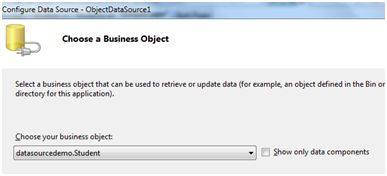
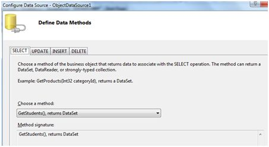
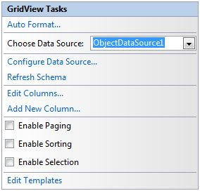
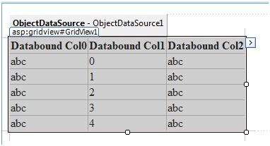
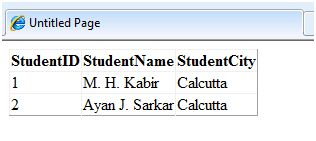

# 数据源

一个 data sourse 控件与数据绑定的控件相互作用，并隐藏了复杂的数据的联编过程。这些是提供数据给 data bound 控件的工具，并且支持如插入，删除和更新操作的执行。  

每一个 data sourse 控件包裹了一个特殊的数据提供者相关的数据库，XML 文件，或者是自定义类，并且帮助：

- 管理连接
- 选择数据
- 管理像分页，缓存等的展示方面
- 操控数据  

有许多可在 ASP.NET 中获得的 data sourse 控件，为从 SQL 服务器，ODBC 或者 OLE DB 服务器，从 XML 文件，和从业务对象中获得数据。  

基于数据类型，这些控件能被分为两个种类：  

- 分层的 data sourse 控件
- 基于表格的 data sourse 控件  

用于分层数据的 data sourse 控件是：

- **XMLDataSource** - 它允许用或者不用模式信息绑定 XML 文件和字符串。
- **SiteMapDataSource** - 它允许绑定一个提供站点地图信息的提供者。  

用作表格数据的 data source 控件是：  

|**Data source 控件**|**描述**|
|:---------|:--------|
|SqlDataSource|它表示到返回 SQL 数据的 ADO.NET data provider 的连接，包括通过 OLEDB 和 QDBC 可获得的 data sources。|
|ObjectDataSource|它允许绑定一个返回数据的自定义的 .Net business 对象|
|LinqdataSource|它允许绑定 Linq-t0-SQL 查询的结果。(仅由 ASP.NET 3.5 支持)|
|AccessDataSource|它表示到 Microsoft Access 数据库的连接。|  

## Data Source 视图  

Data source 视图是 DataSourceView 类的对象，它代表一个自定义的为不同数据操作如排序，过滤等而设计的数据视图。  

DataSourceView 类作为所有 data source 视图类的基本类而使用，它定义了 data source 控件的性能。  

以下表格提供了 DataSourceView 类的属性：  

|**属性**|**描述**|
|:---------|:--------|
|CanDelete|表示是否允许删除潜在的 data source。|
|CanInsert|表示是否允许插入潜在的 data source。|
|CanPage|表示是否允许给潜在的 data source 分页。|
|CanRetrieveTotalRowCount|表示总的行信息能否获得。|
|CanSort|表示数据是否能排序。|
|CanUpdate|表示是否允许在潜在的 data source 上更新。|
|Events|获得 data source 视图代表的事件句柄的列表。|
|Name|视图的名字。|  

以下的表格提供了 DataSourceView 类的方法：  

|**方法**|**描述**|
|:---------|:--------|
|CanExecute|确定指定的命令是否能执行。|
|ExecuteCommand|执行指定的命令。|
|ExecuteDelete|在　DataSourceView 对象所表示的数据列表上执行一个删除操作。|
|ExecuteInsert|在　DataSourceView 对象所表示的数据列表上执行一个插入操作。|
|ExecuteSelect|从潜在的数据存储中获取数据列表。|
|ExecuteUpdate|在　DataSourceView 对象所表示的数据列表上执行一个更新操作。|
|Delete|在和视图所联系的数据上执行一个删除操作。|
|Insert|在和视图所联系的数据上执行一个插入操作。|
|Select|返回被查询的数据。|
|Update|在和视图所联系的数据上执行一个更新操作。|
|OnDataSourceViewChanged|提出 DataSourceViewChanged 事件。|
|RaiseUnsupportedCapabilitiesError|由 RaiseUnsupportedCapabilitiesError 方法调用来将 ExecuteSelect 操作所需要的能力和视图所支持的能力相比较。|  

## SqlDataSource 控件  

SqlDataSource 控件代表到相关数据库比如 SQL Server 或者 Oracle数据库，或者通过 OLEDB 或 Open Database Connectivity(ODBC) 的可存取数据的连接。数据连接通过两个重要的属性 ConnectionString 和 ProviderName 完成。  

以下的代码片段提供了控件的基本语法：  

```
<asp:SqlDataSource runat="server" ID="MySqlSource"
   ProviderName='<%$ ConnectionStrings:LocalNWind.ProviderName  %>'
   ConnectionString='<%$ ConnectionStrings:LocalNWind %>'
   SelectionCommand= "SELECT * FROM EMPLOYEES" />

<asp:GridView ID="GridView1" runat="server" DataSourceID="MySqlSource" />
```  

在潜在的数据上配置不同的数据操作依赖于 data source 控件的不同属性(属性集)。  

以下的表格提供了相关的 SqlDataSource 控件的属性集，它提供了控件的编程接口：  

|**属性组**|**描述**|
|:---------|:--------|
|DeleteCommand,<br>DeleteParameters,<br>DeleteCommandType|获取或设置 SQL 语句，参数和在潜在数据中删除行的类型。|
|FilterExpression,<br>FilterParameters|获取并设置数据过滤字符串和参数。|
|InsertCommand,<br>InsertParameters,<br>InsertCommandType|获取或设置 SQL 语句，参数和在潜在数据中插入行的类型。|
|SelectCommand,<br>SelectParameters,<br>SelectCommandType|获取或设置 SQL 语句，参数和在潜在数据中检索行的类型。|
|SortParameterName|获取或设置一个输入参数的名字，它将被命令存储的过程用来给数据排序。|
|UpdateCommand,<br>UpdateParameters,<br>UpdateCommandType|获取或设置 SQL 语句，参数和在潜在数据中更新行的类型。|  

以下的代码片段展示了能被用来做数据操作的 data source 控件：  

```
<asp:SqlDataSource runat="server" ID= "MySqlSource"
   ProviderName='<%$ ConnectionStrings:LocalNWind.ProviderName  %>'
   ConnectionString=' <%$ ConnectionStrings:LocalNWind %>'
   SelectCommand= "SELECT * FROM EMPLOYEES"
   UpdateCommand= "UPDATE EMPLOYEES SET LASTNAME=@lame"
   DeleteCommand= "DELETE FROM EMPLOYEES WHERE EMPLOYEEID=@eid"
   FilterExpression= "EMPLOYEEID > 10">
   .....
   .....
</asp:SqlDataSource>
```  

## ObjectDataSource 控件  

ObjectDataSource 控件使 user-defined 类能让它们方法的输出和 data bound 控件相连接。这个类的编程接口几乎和 SqlDataSource 控件相同。  

以下是绑定客户对象的两个重要方面：  

- 可绑定的类应该拥有一个默认的构造函数，它应该是无状态的，并且拥有能够映射到选择，更新，插入，和删除语意的方法。  
- 对象必须一次更新一个项目，批处理操作是不支持的。  

让我们直接到一个例子中来使用这个控件。student 类是被用来和一个 data source 对象一起使用的类。这个类有三个属性：a student id，name，和 city。它有一个默认的构造函数和一个检索数据的 GetStudents 方法。  

student 类：  

```
public class Student
{
   public int StudentID { get; set; }
   public string Name { get; set; }
   public string City { get; set; }
   
   public Student()
   { }
   
   public DataSet GetStudents()
   {
      DataSet ds = new DataSet();
      DataTable dt = new DataTable("Students");
      
      dt.Columns.Add("StudentID", typeof(System.Int32));
      dt.Columns.Add("StudentName", typeof(System.String));
      dt.Columns.Add("StudentCity", typeof(System.String));
      dt.Rows.Add(new object[] { 1, "M. H. Kabir", "Calcutta" });
      dt.Rows.Add(new object[] { 2, "Ayan J. Sarkar", "Calcutta" });
      ds.Tables.Add(dt);
      
      return ds;
   }
}
```  

采取以下的步骤来将对线绑定到一个 data source 对象和检索数据：  

- 创建一个新的网页。
- 通过右击 Solution Explorer 的项目来给它添加一个类(Student.cs)，添加一个类模板，将上面的代码放在里面。  
- 建立方法使得应用程序可以使用类的引用。  
- 在网页表单中放置一个 data source 控件对象。  
- 通过选择对象来配置 data source。  



- 给不同的数据操作选择数据方法。在这个例子中，仅有一个方法。  

  

- 在页面上放置一个 data bound 控件比如 grid view 并且选择 data source 对象作为潜在的 data source。  

  

- 在这个阶段，设计视图应该像以下这样：  



- 运行项目，它检索了 students 类中的硬编码的元祖。  

  

## AccessDataSource 控件  

AccessDataSource 控件代表了到 Access 数据库的连接。它基于 SqlDataSource　控件并提供了更简单的编程接口。以下的代码片段提供了 data source 的基本语法：  

```
<asp:AccessDataSource ID="AccessDataSource1 runat="server" 
   DataFile="~/App_Data/ASPDotNetStepByStep.mdb" SelectCommand="SELECT * FROM  [DotNetReferences]">
</asp:AccessDataSource>
```  

AccessDataSource 控件打开了只读模式的数据库。但是，它也能被用来执行插入，更新或者删除操作。这以使用 ADO.NET 命令和参数集合来完成。  

更新对于 ASP.NET 应用程序内的 Access 数据库来说是有问题的，这是因为 Access 数据库是一个纯文本并且默认的 ASP.NET 应用程序账户可能有写数据库文件的权限。
