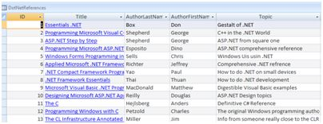
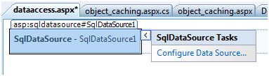
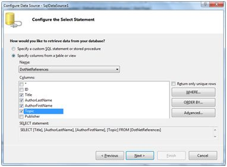
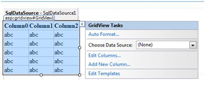
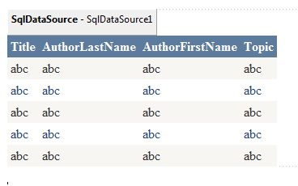
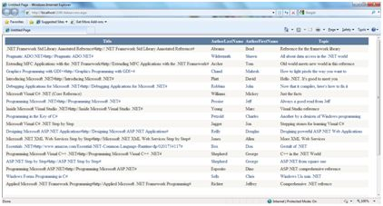

# ASP.NET - 数据库存取

ASP.NET 允许存取和使用下列数据源：  

- 数据库（例如：Access、 SQL Server、 Oracle、 MySQL）  
- XML 文档  
- Business Objects  
- Flat files  

ASP.NET 隐藏了复杂的数据存取过程并且提供了更为高级的类和对象，通过他们数据可以更容易的存取。这些类隐藏了所有的连接，数据存取，数据检索和数据操纵的复杂的代码。  
ADO.NET 技术提供了各种 ASP.NET 控件对象和后台数据之间的桥梁。在本指导中，我们着眼于数据存取并且简单的介绍数据。  

## 检索和显示数据

在 ASP.NET 中检索和显示数据需要两种类型的数据控制： 

- **数据源控制** - 它管理数据的连接、数据的选择和其他工作，例如数据的分页和缓存等等。
- **数据显示控制** - 这将约束和显示数据并且允许操作数据。

我们将在以后详细探讨数据约束和数据源控制。在本节中，我们将应用 SqlDataSource 控件存取数据。在本章用 GridView 控件显示和操作数据。  
我们也会应用 Access 数据库，它包含了市场上有的 .Net 书籍的细节信息。将我们的数据库命名为 ASPDotNetStepByStep.mdb 并且我们将应用名为 DotNetReferences 的数据表。  
这张表包含了以下栏目：ID、Title、AuthorFirstName、AuthorLastName、Topic 和 Publisher。  
下图是这个数据表的截图：  

  

下面让我们直接按照下面步骤实践：  

**（1）**创建一个网站并且在网页表格中添加 SqlDataSourceControl。  

  

**（2）**单击 Configure Data Source 选项。  

  

**（3）**点击 New Connection 按钮建立数据库连接。  

  
**（4）**连接一旦建立，你就可以保存他们以备以后应用。下一步，你会被要求设置 select statement：  

  

**（5）**选择好 columns 中的项目后点击 next 按钮完成剩余步骤。观察 WHERE, ORDER BY, 和 Advanced 按钮。这些按钮允许你执行 where 子句，order by 子句并且分别指定 SQL 中的插入，更新和删除命令。这样你就可以对数据进行操作了。  
**（6）**在表中添加 GridView 控件。选择数据源并且用 AutoFormat 选项生成控件。  

  

**（7）**在这之后设置的 GridView 控件可以显示栏目标题，这个程序就可以执行了。

  

**（8）**最后执行该程序。 

  

以上涉及的代码列示如下：  

```
<%@ Page Language="C#" AutoEventWireup="true" CodeBehind="dataaccess.aspx.cs" 
   Inherits="datacaching.WebForm1" %>

<!DOCTYPE html PUBLIC "-//W3C//DTD XHTML 1.0 Transitional//EN" 
   "http://www.w3.org/TR/xhtml1/DTD/xhtml1-transitional.dtd">

<html xmlns="http://www.w3.org/1999/xhtml" >

   <head runat="server">
      <title>
         Untitled Page
      </title>
   </head>
   
   <body>
      <form id="form1" runat="server">
         <div>
         
            <asp:SqlDataSource ID="SqlDataSource1" runat="server" 
               ConnectionString= "<%$   ConnectionStrings:ASPDotNetStepByStepConnectionString%>" 
               ProviderName= "<%$ ConnectionStrings:
                  ASPDotNetStepByStepConnectionString.ProviderName %>" 
               SelectCommand="SELECT [Title], [AuthorLastName], 
                  [AuthorFirstName], [Topic] FROM [DotNetReferences]">
            </asp:SqlDataSource>
            
            <asp:GridView ID="GridView1" runat="server" 
               AutoGenerateColumns="False" CellPadding="4" 
               DataSourceID="SqlDataSource1" ForeColor="#333333" 
               GridLines="None">
               <RowStyle BackColor="#F7F6F3" ForeColor="#333333" />
            
               <Columns>
                  <asp:BoundField DataField="Title" HeaderText="Title" 
                     SortExpression="Title" />
                  <asp:BoundField DataField="AuthorLastName" 
                     HeaderText="AuthorLastName" SortExpression="AuthorLastName" />
                  <asp:BoundField DataField="AuthorFirstName" 
                     HeaderText="AuthorFirstName" SortExpression="AuthorFirstName" />
                  <asp:BoundField DataField="Topic" 
                     HeaderText="Topic" SortExpression="Topic" />
               </Columns>
               <FooterStyle BackColor="#5D7B9D" 
                  Font-Bold="True" ForeColor="White" />
               <PagerStyle BackColor="#284775" 
                  ForeColor="White" HorizontalAlign="Center" />
               <SelectedRowStyle BackColor="#E2DED6" 
                  Font-Bold="True" ForeColor="#333333" />
               <HeaderStyle BackColor="#5D7B9D" Font-Bold="True"  
                  ForeColor="White" />
               <EditRowStyle BackColor="#999999" />
               <AlternatingRowStyle BackColor="White" ForeColor="#284775" />
            </asp:GridView>
         </div>
      </form>
   </body>
</html>
```  
