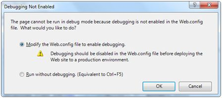
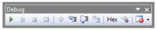
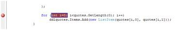
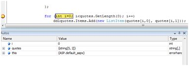
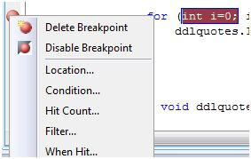
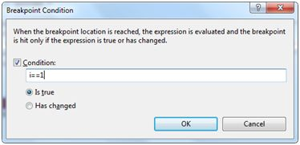
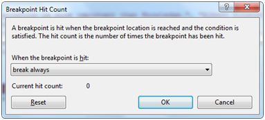
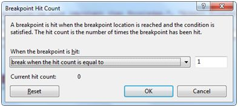
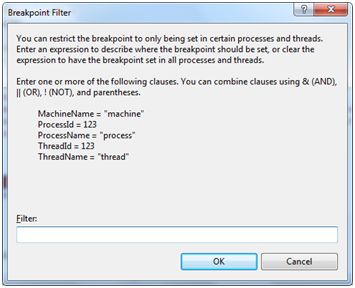
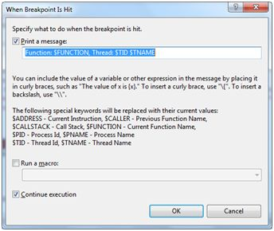

# 调试

Debugging 可以让开发人员一步一步的看到代码是怎样工作的，变量的值是如何变化的和对象是怎样被创建又是怎样被销毁的等等。

当一个网页第一次被运行时，Visual Studio 会弹出一个提示框来询问 Debugging 是否需要被启用：  

  

当 debugging 被启用时，下面几行代码将在 web.config 文件中出现：
  
```
<system.web>  
    <compilation debug="true">  
        <assemblies>  
        ..............  
        </assemblies>  
    </compilation>  
</system.web>  
``` 

Debugging 工具栏会提供所有 debugging 所需的工具：  



## 断点  

断点规定程序在运行时在运行完指定的代码行之后立即停止运行，这样可以测试代码并且完成各种各样的 debugging 工作，例如，观察变量值的变化，单步调试代码，函数方法的跳入跳出等。  
在代码上单击右键选择插入一个间断点来设置断点。然后在左边会出现一个红点并且该行代码被高亮显示，效果如图所示： 

  

之后你运行这段代码，将会观察到断点的行为。 

  

在这个阶段，你可以单步调试代码，观察运行的流程和变量值、属性、对象等。  

如果你需要修改断点属性，你可以在断点标志上单击右键，在“属性”菜单中找到： 

  

location 对话框显示文件所在位置，以及所选中的代码所在行数和字符数。condition 菜单允许你输入一个有效的表达式来估算程序是否运行到了断点:  

  

Hit Count 菜单显示一个对话框来显示断点被运行的次数。  

  

点击下拉菜单中的任何一个选项会打开一个用来输入命中次数的编辑框。这在分析循环结构的代码时非常有用。  

  

Filter 菜单允许设置一个对特定机制、过程、线程或是任何组合的过滤使断点对它们生效。

  

When Hit 菜单允许你来指定当断点命中时的动作。  

  

## Debug 窗口 

Visual Studio 提供下面的 debug 窗口，其中每一个都显示一些程序信息。下表列出了一些窗口： 

|**窗口**   | **描述**         |
|:---------|:------------|  
|直接|显示变量和表达式。 |  
|自动|显示当前所有变量以及之前的状态。|
|本地|显示当前上下文的所有变量。|
|观察|显示多达四个不同集合的变量。|
|调用栈|显示调用栈中的所有方法。|
|线程|显示并控制线程。|
