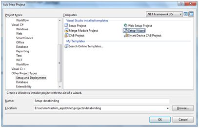
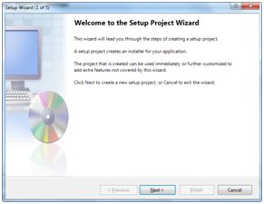
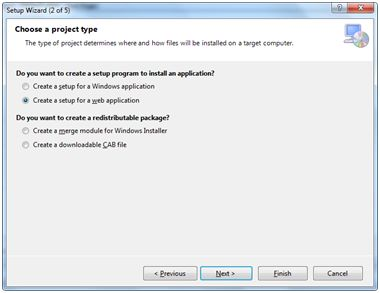
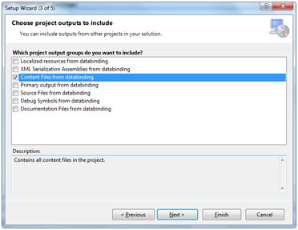
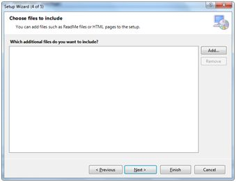
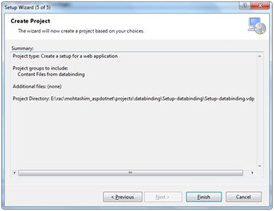
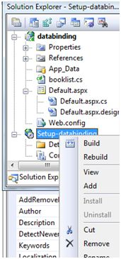
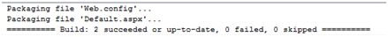

# 部署

目前存在两类 ASP.NET 部署：  

- **Local deployment（本地部署）**：在这种情况下，整个应用程序都包含在一个虚拟目录下，所有的内容和程序集都包含在其中，可被应用程序使用。  
- **Global deployment（全局部署）**：在这种情况下，组件可以被每一个在应用服务器上运行的应用程序所使用。  

然而在部署中我们可以利用多种不同的技术，以下我们将讨论最常见和最简单的部署方式：  

- XCOPY 部署  
- 复制一个网站  
- 创建一个设置项目   

## XCOPY 部署

XCOPY 部署是说将所有文件递归拷贝到目标计算机上的目标文件夹。你可以使用以下任何的常用技术：  

- FTP 传输  
- 使用提供对远程站点复制的服务器管理工具  
- MSI 安装程序应用  

XCOPY 部署简单地拷贝程序文件到生产服务器，并在其中设置一个虚拟目录。你需要使用互联网信息微软管理控制台（MMC 管理单元）去设置虚拟目录。

## 复制一个网站

在 Visual Studio 中复制网站是可用的选项。它可在 Website -> Copy Web Site 菜单选项中实现。此菜单项允许复制当前网站到另一个本地或远程位置。它是一种集成的 FTP 工具。

使用以下几种选项连接到你的目的地来选择所需的复制模式：  

- 覆盖  
- 从源到目标文件  
- 同步源和目标项目    

然后通过物理方式复制文件。这里不像 XCOPY 部署，这个过程是从 Visual Studio 环境中进行部署的。然而，以下两个以上部署的方法都有以下问题：  

- 你传递了你的源代码。  
- 没有预编译和错误检查的文件。  
- 初始页面加载会很慢。  

## 创建一个设置项目 

在这种方法中，你使用了 Windows Installer 并且打包好 Web 应用程序使它可以部署在生产服务器。Visual Studio 允许你创建部署包。那么让我们测试一个我们现有的项目，数据绑定方案。 
 
打开项目，采取以下步骤：  

**步骤（1）**：Select File -> Add -> New Project，使用显示在解决方案资源管理器的网站根目录。    

**步骤（2）**：在 Other Project Types 下选择 Setup and Deployment，然后选择 Setup Wizard。  

**步骤（3）**：选择默认位置，确保将在根目录下自己的文件夹站点下建立项目。点 Okay 我们就得到了向导的第一个屏幕。  

**步骤（4）**：选择项目类型。选择 ‘Create a setup for a web application’。    

 

**步骤（5）**：下一步，第三屏要从解决方案中的所有项目选择项目输出。选中复选框旁边的 ‘Content Files from...’ 

  

**步骤（6）**：第四屏幕允许包括例如自述等其他文件。然而，在我们的案例中并没有这样的文件。单击结束。  

  

**步骤（7）**：最后的屏幕显示设置项目总结。  

**步骤（8）**：设置项目添加到解决方案资源管理器，主设计窗口中会显示一个文件系统编辑器。

**步骤（9）**：下一步是创建安装项目。在 Solution Explorer 中右键单击项目名称，选择 Build。 

  

**步骤（10）**：当建立完成后，你在输出窗口中会得到以下信息：  

  

两个文件在生成过程被创建：  

- Setup.exe  
- Setup-databinding.msi  

你需要将这些文件复制到服务器。在本地机器上双击安装文件来安装 MSI 文件的内容。
