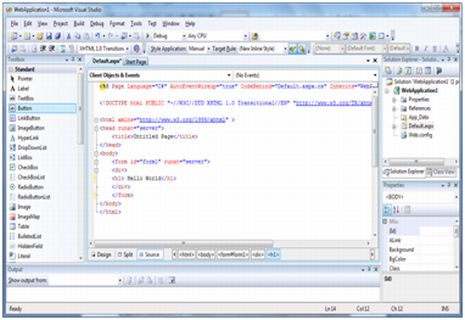
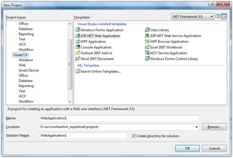

# ASP.NET - 环境设置

ASP.NET 在 HTTP 的顶部提供了一个抽象层，即应用程序所构建的地方。它提供了高层次的实体，例如一个面向对象的范例中的类和组件。

构建 ASP.NET 应用程序的关键开发工具及前端是 Visual Studio。本教程中，我们主要讲 Visual Studio 2008。

Visual Studio 是一个整体的开发环境，用于编写，编译和除错代码。它为构建 ASP.NET web 应用程序、web 服务、桌面应用程序和移动应用程序提供了一组完整的开发工具。

## Visual Studio IDE

新型的项目窗口允许从可用模板中选择一个应用程序模板。

当你打开一个新的网站，ASP.NET 提供启动文件夹和网站的文件，包括站点中的第一个 web 表单的两个文件。

名称为 Default.aspx 的文件包括 HTML 和 asp 代码，可以定义表单，名称为 Default.aspx.cs（为 C# 编码）的文件或者名称为 Default.aspx.vb（为 VB 编码）的文件包含你所选择的语言的代码，并且此代码为一个表单中所执行的动作所负责。

在 Visual Studio IDE 中的初始窗体 是 Web Forms Designer 窗口。其他支持的窗口有工具箱、解决方案资源管理器以及内容窗口。你使用设计师设计一个 web 表单，在表单上添加代码进行控制从而使表单根据你所需工作，你使用代码编辑程序。

## 使用视图和窗口

你可以用以下方式使用窗口：

- 把 Web 表单设计器从一个视图改变到另一个视图，点击 Design 或者源按钮。  
- 要关闭一个窗口，点击右上角的关闭按钮，重新显示的话，从视图菜单中选择。  
- 要隐藏一个窗口，点击自动隐藏按钮。窗口就会变成一个标签。再次显示的话，再次点击自动隐藏按钮。  
- 要改变窗口的大小，拖拽窗口即可。

## 在你的网站中添加文件夹和文件

当创造了一个新的 web 表单，Visual Studio 自动为表单生成启动 HTML，并且在 web 表单设计器上显示出源视图。解决方案资源管理器被用于添加其他任何文件，文件夹或者在 web 站点的现有项目。  

- 要增加一个标准的文件夹，右键点击你将要在解决方案管理器中添加的项目或文件夹，选择新文件夹。  
- 要增加一个 ASP.NET 文件夹，右键点击在解决方案管理器中的项目，在列表中选择文件夹。  
- 要在站点中添加一个现有项，右键点击你将要在解决方案管理器中添加的项目，在对话窗口中选择。

## 项目和解决方案

一个典型的 SP.NET 应用程序由许多的项目组成：web 内容文件（.aspx），源文件（.cs 文件），程序集（.dll 和 .exe 文件），数据源文件（.mgd 文件），引用，图标，用户控件和其他杂项文件和文件夹。所有组成网址的这些文件包含在一个解决方案中。

当创造了一个新的网站，.VB2008 自动创造了解决方案，并且在解决方案管理器中显示。

解决方案可能包含一个或多个项目。一个项目包含内容文件，源文件，以及其他文件比如说数据源和图片文件。一般来说，一个项目的内容可以编译成一个程序集作为一个可执行文件（.exe）或者一个动态链接库（.dll）文件

一般来说一个项目包含以下内容文件：  

- 页面文件（.aspx）
- 用户控件（.ascx）
- Web 服务器（.asmx）
- 主版页（.master）  
- 网站导航（.sitemap）  
- 网站配置文件（.config）

## 建立和运行项目

你可以执行一个应用程序，通过：  

- 选择启动  
- 选择启动而不从调试菜单中调试  
- 按 F5  
- Ctrl-F5

程序是构建意义，.exe 和 .dll 文件从 Build 菜单中选择一个命令而生成。

