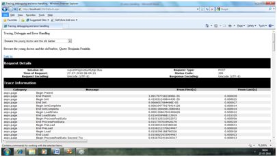
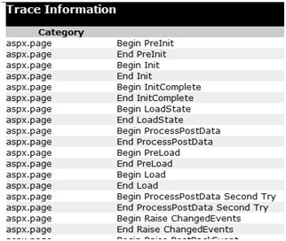
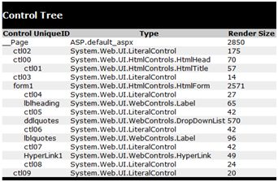
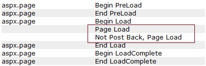
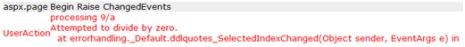

# 异常处理  

在 ASP.NET 中异常处理有三个方面：  

- **Tracing** - 在页面级或者应用程序级追踪程序执行。
- **Error handling** - 在页面级或者应用程序级解决标准错误或者自定义错误。
- **Debugging** - 在程序中前进，设置断点来分析代码。  

在这一章中，我们将讨论 tracing 和 handling。并且在这一章中，我们将讨论 debugging。  

为了理解概念，创建以下的样本应用程序。它有一个 label　控件，一个 dropdown 列表和一个链接。dropdown 列表加载了一个名言的 array 列表并且被选择的引用将显示在下面的标签中。它也拥有一个超链接，它指向一个不存在的链接。  

```
<%@ Page Language="C#" AutoEventWireup="true" CodeBehind="Default.aspx.cs" Inherits="errorhandling._Default" %>

<!DOCTYPE html PUBLIC "-//W3C//DTD XHTML 1.0 Transitional//EN" "http://www.w3.org/TR/xhtml1/DTD/xhtml1-transitional.dtd">

<html xmlns="http://www.w3.org/1999/xhtml" >

   <head runat="server">
      <title>
         Tracing, debugging and error handling
      </title>
   </head>
   
   <body>
      <form id="form1" runat="server">
      
         <div>
            <asp:Label ID="lblheading" runat="server" Text="Tracing, Debuggin  and Error Handling">
            </asp:Label>
            
            <br /> <br />
            
            <asp:DropDownList ID="ddlquotes" runat="server" AutoPostBack="True"  onselectedindexchanged="ddlquotes_SelectedIndexChanged">
            </asp:DropDownList>
            
            <br /> <br />
            
            <asp:Label ID="lblquotes" runat="server">
            </asp:Label>
            
            <br /> <br />
            
            <asp:HyperLink ID="HyperLink1" runat="server" NavigateUrl="mylink.htm">Link to:</asp:HyperLink>
         </div>
         
      </form>
   </body>
   
</html>
```  

文件后的代码：  

```
public partial class _Default : System.Web.UI.Page
{
   protected void Page_Load(object sender, EventArgs e)
   {
      if (!IsPostBack)
      {
         string[,] quotes = 
         {
            {"Imagination is more important than Knowledge.", "Albert Einsten"},
            {"Assume a virtue, if you have it not" "Shakespeare"},
            {"A man cannot be comfortable without his own approval", "Mark Twain"},
            {"Beware the young doctor and the old barber", "Benjamin Franklin"},
            {"Whatever begun in anger ends in shame", "Benjamin Franklin"}
         };
         
         for (int i=0; i<quotes.GetLength(0); i++)
            ddlquotes.Items.Add(new ListItem(quotes[i,0], quotes[i,1]));
      }
   }
   
   protected void ddlquotes_SelectedIndexChanged(object sender, EventArgs e)
   {
      if (ddlquotes.SelectedIndex != -1)
      {
         lblquotes.Text = String.Format("{0}, Quote: {1}", ddlquotes.SelectedItem.Text, ddlquotes.SelectedValue);
      }
   }
}
```

## Tracing  

为了允许页面级别的追踪，你需要修改 Page 指令并且如下添加一个 Trace 属性：  

```
<%@ Page Language="C#" AutoEventWireup="true" CodeBehind="Default.aspx.cs"
   Inherits="errorhandling._Default" Trace ="true" %>
```  

现在当你执行文件时，你将得到追踪信息：



它在首部提供了以下的信息：  

- Session ID 
- Status Code
- Time of Request
- Type of Request
- Request and Response Encoding  

每次页面被需要时，从服务器发出的 status 代码显示名字和错误时间，如果有的话。以下的表格显示普通的 HTTP status 代码：

|**数字**|**描述**|
|:-----|:------|
|**通知(100 - 199)**|
|100|继续|
|101|转换协议|
|**成功(200 - 299)**|
|200|OK|
|204|无内容|
|**重定向(300 - 399)**|
|301|永久移动|
|305|使用代理|
|307|暂时重定向|
|**来自客户端的错误(400 - 499)**|
|400|错误请求|
|402|支付需求|
|404|未找到|
|408|请求超时|
|417|期望失败|
|**来自服务器的错误(500 - 599)**|
|500|内部服务器错误|
|503|服务不可用|
|505|HTTP 版本不支持|  

在顶级信息下，有一个 Trace 日志，它提供了页面生命周期的细节。它提供了页面被初始化后的以秒为单位的运行时间。  

  

下一个部分是控件树，它以分层的形式列举了页面上所有的控件：  

  

Session 和 Application 中的最后声明了跟随了所有服务器变量的 summaries,cookies 和 headers 集合。  

Trace 对象允许你给 trace 输出添加自定义信息。它有两个方法来完成：Write 方法和 Warn 方法。  

改变 Page_Load 事件句柄在检测 Write 方法：  

```
protected void Page_Load(object sender, EventArgs e)
{
   Trace.Write("Page Load");
   
   if (!IsPostBack)
   {
      Trace.Write("Not Post Back, Page Load");
      string[,] quotes = 
      .......................
   }
}
```  

运行来观察影响：  

  

为了检测 Warn 方法，让我们在被选择的 index changed 事件句柄中强制输入一些错误的代码：  

```
try
{
   int a = 0;
   int b = 9 / a;
}catch (Exception e)
{
   Trace.Warn("UserAction", "processing 9/a", e);
}
```  

Try-Catch 是一个 C# 编程结构。try 块持有任何可以或不可以产生错误的代码，catch 块捕获了错误。当程序运行时，它在 trace 日志中发送警告。  

 

应用程序层次的追踪应用到网站中的所有的页面。它通过将以下代码放入 web.config 文件被实现：  

```
<system.web>
   <trace enabled="true" />
</system.web>
```  

## 错误解决  

尽管 ASP.NET 能检测所有的运行时错误，仍然有一些微小的错误仍在那儿。通过追踪观察错误是为开发者准备的，而不是用户。  

因此，为了拦截这样情况的发生，你可以在应用程序的 web.config 中添加错误解决设置。它是应用程序范围的错误解决。例如，你可以在 web.config 文件中添加以下的代码：  

```
<configuration>
   <system.web>
   
      <customErrors mode="RemoteOnly" defaultRedirect="GenericErrorPage.htm">
         <error statusCode="403" redirect="NoAccess.htm"	/>
         <error statusCode="404" redirect="FileNotFound.htm" />
      </customErrors>
      
   </system.web>
<configuration>
```  

<customErrors>部分有可能的属性：  

- **Mode：**它允许或者不允许自定义错误页面。它有三个可能的值：  
 - **On:**展示自定义页面。  
 - **Off：**展示 ASP.NET 错误页面(黄色页面)  
 - **remoteOnly：**它展示了自定义错误到客户端，展示本地的 ASP.NET 错误。
- **defaultRedirect:**它含有页面的 URL 来展示以备不能解决的错误。  

为了给不同错误类型放置不同的自定义错误页面，<error>子标签被使用，那里不同的错误页面基于错误的 status 代码被指定。  

为了实现页面级别的错误解决，Page 指令能被修改为： 

```
<%@ Page Language="C#" AutoEventWireup="true" CodeBehind="Default.aspx.cs"
   Inherits="errorhandling._Default" Trace ="true" ErrorPage="PageError.htm" %>
```  

因为 ASP.NET Debugging 是它内部一个重要的主题，因此我们将在下一章单独地讨论它。
