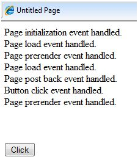

# ASP.NET – 事件处理

事件是一个动作或事件，如鼠标单击、按键、鼠标移动，或任何系统生成的通知。一个进程通过事件进行沟通。例如，中断是系统生成的事件。当事件发生，应用程序也能够回应和管理。

ASP.NET 上的事件在用户机器上引发，在服务器机器上处理。例如，一个用户点击了在浏览器中显示的一个按钮。一个点击事件被引发。浏览器通过把它发送给服务器从而处理这个客户端事件。

服务器有一个子程序来描述当事件被引发时该做什么；这个被称为事件处理程序。因此，当事件信息被传递给服务器，它会检查点击事件是否与事件处理程序有关联。如果有关联的话，事件处理程序就会被执行。

## 事件参数

ASP.NET 事件处理程序一般采取两项参数并返回空白。第一个参数代表了对象激发事件，第二个参数是事件参数。

一个事件的一般句法是：

```
private void EventName (object sender, EventArgs e);
```

## 应用程序和会话事件

最重要的应用程序事件是：

•	**Application_Start** - 当开启应用程序或者网页时被引发。</br>
•	**Application_End** - 当停止应用程序或者网页时被引发。

同样地，最常使用的会话事件是：

•	**Session_Start** – 当用户最开始从应用程序上请求一个页面被引发。</br>
•	**Session_End** – 当会话结束后被引发。

## 页面和控件事件

常见的页面和控件事件有：

•	**DataBinding** – 当一个控件绑定到一个数据源时被引发。

•	**Disposed** – 当释放页面或者控件时被引发。

•	**Error** – 它是一个页面事件，当有未处理的异常时发生。

•	**Init** – 当初始化页面或者控件时被引发。

•	**Load** – 当加载页面或者控件时被引发。

•	**PreRender** – 当显示页面或者控件时被引发。

•	**Unload** – 当从内存中卸载页面或者控件时被引发。

## 使用控件处理事件

所有的 ASP.NET 控件作为类而实现，并且当用户对其执行一个特定的动作时，它们会引发事件。比如说，当一个用户点击了一个按钮，那就生成了‘点击’事件。对于处理事件来说，有内置属性和事件处理程序。事件处理应用程序被编码作为一个事件的回应，并且对其采取适当的行动。

默认情况下，Visual Studio 创建一个事件处理程序，包括处理条款的子程序。这个子句命名程序处理的控件和事件。

按钮控件的 ASP 标签：

```
<asp:Button ID="btnCancel" runat="server" Text="Cancel" />
```

Click 事件的事件处理应用程序：

```
Protected Sub btnCancel_Click(ByVal sender As Object, ByVal e As System.EventArgs) 

   Handles btnCancel.Click
   
End Sub
```

一个事件同样可以在没有 Handles 子句的前提下被编码。然后，处理程序必须根据适合控件属性的适当事件进行命名。

按钮控件的 ASP 标签：

```
<asp:Button ID="btnCancel" runat="server" Text="Cancel" Onclick="btnCancel_Click" />
```

Click 事件的事件处理应用程序：

```
Protected Sub btnCancel_Click(ByVal sender As Object, ByVal e As System.EventArgs)

End Sub
```

常见的控件事件有：

|事件|	属性|	控件|
|:---|:-----|:----|
|Click|OnClick|按钮，图像按钮，链接按钮，图像导位图|
|Command|OnCommand|按钮，图像按钮，链接按钮|
|TextChanged|OnTextChanged|文本框|
|SelectedIndexChanged|OnSelectedIndexChanged|下拉菜单，列表框，单选按钮列表，带复选框的列表框|
|CheckedChanged|OnCheckedChanged|复选框，单选按钮|

一些事件导致表单立即发回到服务器，这些被称为回发事件。例如，单击事件像 Button.Click。

一些事件则不会被立即发回到服务器，这些被称为非回发事件。

例如，改变事件或者选择事件，像 TextBox.TextChanged 或者 CheckBox.CheckedChanged。这些非回发事件可以通过设置它们的 AutoPostBack 属性为 true 便可立即使它们回发。

## 默认事件

页面对象的默认事件是加载事件。相似地，每一个控件都有一个默认的事件。比如，按钮控件的默认事件就是 Click 事件。

默认事件处理程序可以在 Visual Studio 中创建，仅通过双击设计视图中的控件。以下表格展示了一写常见控件的默认事件：

|控件|默认事件|
|:---|:-------|
|AdRotator|AdCreated|
|BulletedList|	Click|
|Button|	Click|
|Calender|	SelectionChanged|
|CheckBox	|CheckedChanged|
|CheckBoxList|	SelectedIndexChanged|
|DataGrid	|SelectedIndexChanged|
|DataList	|SelectedIndexChanged|
|DropDownList|	SelectedIndexChanged|
|HyperLink|	Click|
|ImageButton	|Click|
|ImageMap	|Click|
|LinkButton	|Click|
|ListBox	|SelectedIndexChanged|
|Menu	|MenuItemClick|
|RadioButton|	CheckedChanged|
|RadioButtonList|	SelectedIndexChanged|

示例

这个例子包括一个简单页面，上面有控件标签和一个按钮控件。当页面事件，例如 Page_Load,，Page_Init， Page_PreRender 等等事件发生的时候，它就会发送一条信息，会由标签控件显示。当点击一个按钮，Button_Click 事件被引发，同样发送一条由标签展示的信息。

创建一个新的网站，从控件工具框中拖拽一个标签控件和按钮控件。使用窗口属性，相应地设置控件的 ID 为 .lblmessage. and .btnclick。设置按钮控件的文本属性为“Click”。

标记文件（.aspx）：

```
<%@ Page Language="C#" AutoEventWireup="true" CodeBehind="Default.aspx.cs" 
   Inherits="eventdemo._Default" %>

<!DOCTYPE html PUBLIC "-//W3C//DTD XHTML 1.0 Transitional//EN" 
   "http://www.w3.org/TR/xhtml1/DTD/xhtml1-transitional.dtd">

<html xmlns="http://www.w3.org/1999/xhtml" >

   <head runat="server">
      <title>Untitled Page</title>
   </head>
   
   <body>
      <form id="form1" runat="server">
         <div>
            <asp:Label ID="lblmessage" runat="server" >
            
            </asp:Label>
            
            <br />
            <br />
            <br />
            
            <asp:Button ID="btnclick" runat="server" Text="Click" onclick="btnclick_Click" />
         </div>
      </form>
   </body>
   
</html>
```

双击设计视图并移动至文件后的代码。Page_Load 事件是自动创建的，其中没有任何的代码。写下以下的自我解释的代码行：

```
using System;
using System.Collections;
using System.Configuration;
using System.Data;
using System.Linq;

using System.Web;
using System.Web.Security;
using System.Web.UI;
using System.Web.UI.HtmlControls;
using System.Web.UI.WebControls;
using System.Web.UI.WebControls.WebParts;

using System.Xml.Linq;

namespace eventdemo {

   public partial class _Default : System.Web.UI.Page {
   
      protected void Page_Load(object sender, EventArgs e) {
         lblmessage.Text += "Page load event handled. <br />";
         
         if (Page.IsPostBack) {
            lblmessage.Text += "Page post back event handled.<br/>";
         }
      }
      
      protected void Page_Init(object sender, EventArgs e) {
         lblmessage.Text += "Page initialization event handled.<br/>";
      }
      
      protected void Page_PreRender(object sender, EventArgs e) {
         lblmessage.Text += "Page prerender event handled. <br/>";
      }
      
      protected void btnclick_Click(object sender, EventArgs e) {
         lblmessage.Text += "Button click event handled. <br/>";
      }
   }
}
```

执行页面。标签显示页面加载，页面初始化以及页面预览事件。点击按钮查看效果：




