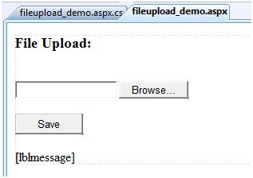

# ASP.NET - 文件上传

ASP.NET 包含两个控件可以使用户向网页服务器上传文件。一旦服务器接受了上传的文件数据，那么应用程序就可以进行保存，进行检查或者忽略它。接下来的控件允许文件上传：  

- **HtmlInputFile** - HTML 服务器控件  
- **FileUpload** - ASP.NET 网页控件  

两种控件都允许文件上传，但是 FileUpload 控件自动设置编码格式，然而 HtmlInputFile 控件并不会这样。  

本指导中，我们将应用 FileUpload 控件。这个控件允许用户预览选择将要上传的文件，它提供了一个预览按钮和一个可以输入文件名的文本框。  

一旦用户在文本框中输入文件名或者预览文件，FileUpload 控件的 SaveAs 方法就会将文件保存到硬盘。  

FileUpload 的基本语法如下：  

```
<asp:FileUpload ID= "Uploader" runat = "server" />
```  

FileUpload 类是从 WebControl 类中得出的，并且它继承了它的所有元素，FileUpload 类具有以下这些只读属性：

|**属性**   | **描述** |  
|:---------|:-----------|  
|FileBytes|返回一组将要上传文件的字节码|  
|FileContent|返回将要被上传的的文件的流对象|  
|FileName|返回将以上传的文件名称|  
|HasFile|判断控件是否有文件需要上传|  
|PostedFile|返回一个关于已上传文件的参考|  

发布的文件以 HttpPostedFile 形式的对象进行封装，这个对象可以通过 FileUpload 类的 PostedFile 属性被存取。  

HttpPostedFile 类具有以下常用的属性：  

|**属性**   | **描述**         |  
|:---------|:-----------|  
|ContentLength|返回已上传的文件的字节大小|  
|ContentT ype|返回已上传的文件的 MIME 类型|  
|FileName|返回文件全名|  
|InputStream|返回将要被上传的的文件的流对象|  

## 例子 

下面的例子说明了 FileUpload 控件以及它的属性。这个表格有一个 FileUpload 控件以及一个保存按钮和一个真实文件名称、类型、长度的标签控件。  

在设计模式下，表格如下图所示：  

  

相关文件代码列示如下：  

```
<body>
   <form id="form1" runat="server">
   
      <div>
         <h3> File Upload:</h3>
         <br />
         <asp:FileUpload ID="FileUpload1" runat="server" />
         <br /><br />
         <asp:Button ID="btnsave" runat="server" onclick="btnsave_Click"  Text="Save" style="width:85px" />
         <br /><br />
         <asp:Label ID="lblmessage" runat="server" />
      </div>
      
   </form>
</body>
```  

保存按钮的代码列示如下：  

```

protected void btnsave_Click(object sender, EventArgs e)
{
   StringBuilder sb = new StringBuilder();
   
   if (FileUpload1.HasFile)
   {
      try
      {
         sb.AppendFormat(" Uploading file: {0}", FileUpload1.FileName);
         
         //saving the file
         FileUpload1.SaveAs("<c:\\SaveDirectory>" + FileUpload1.FileName);
      
         //Showing the file information
         sb.AppendFormat("<br/> Save As: {0}",  FileUpload1.PostedFile.FileName);
         sb.AppendFormat("<br/> File type: {0}",    FileUpload1.PostedFile.ContentType);
         sb.AppendFormat("<br/> File length: {0}",  FileUpload1.PostedFile.ContentLength);
         sb.AppendFormat("<br/> File name: {0}",  FileUpload1.PostedFile.FileName);
         
      }catch (Exception ex)
      {
         sb.Append("<br/> Error <br/>");
         sb.AppendFormat("Unable to save file <br/> {0}", ex.Message);
      }
   }
   else
   {
      lblmessage.Text = sb.ToString();
   }
}
```  

注意以下问题：

- StringBuilder 类是由 System.IO 命名空间产生，所以应该包括它。
- try 和 catch 区域是用来捕捉错误、显示错误信息的。  
