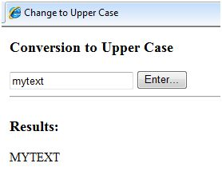
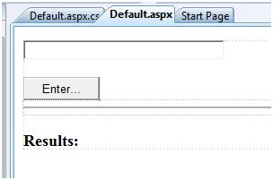
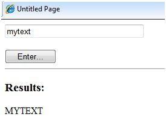

# 首例

ASP.NET 页面是由大量的服务器控件以及 HTML 控件、文本和图像组成的。页面的敏感数据和页面上的不同控件状态被储存在隐藏字段中，组成了页面请求的配置指令。

ASP.NET 运行时控制一个页面实例和其状态的关联。一个 ASP.NET 页面是一个页面的对象或者从之继承而来。

页面上所有的控件同样也是从一个父类控件继承而来的相关控件类的对象。当一个页面运行时，对象页面的一个实例就随其内容控件一起被创建。

一个 ASP.NET 页面同样也是储存在 .aspx 延伸的服务器端文件。

它在本质上是模块化的，并且可被分成以下几个核心部分：

- 网页指令
- 编码区段
- 页面布局

## 页面指令

页面指令为页面设置运行环境。@Page 指令定义了使用 ASP.NET 页面解析器和编译器的特殊页面属性。页面指令指定应该如何处理页面，并指定对页面需要采取的假设。

它允许导入命名空间、加载程序集和注册新的控件，包括自定义标记名称和命名空间前缀。

## 编码区段

编码区段为页面和控件即其他所需功能提供处理程序。我们提到，ASP.NET 遵从对象模型。现在，当一些事件在用户界面发生，这些对象会激发事件，比如说一个用户点击了一个按钮或者移动了光标。这些事件需要往复的这类响应是在事件处理程序功能里编码的。事件处理程序除了绑定到空间上的功能就没什么了。

编码区段或者文件后的编码提供了对于所有这些事件处理程序的路线，以及其他开发者使用的功能。页面代码可以预编译和以二进制汇编的形式进行部署。

## 页面布局

页面布局提供了页面的界面。它包含服务器控件、文本和内联的 JavaScript 和 HTML 标签。

下面的代码片段提供了一个 ASP.NET 页面的示例，解释了用 C# 编写的页面指令、代码区段和页面布局：

```
<!-- directives -->
<% @Page Language="C#" %>

<!-- code section -->
<script runat="server">

   private void convertoupper(object sender, EventArgs e)
   {
      string str = mytext.Value;
      changed_text.InnerHtml = str.ToUpper();
   }
</script>

<!-- Layout -->
<html>
   <head> 
      <title> Change to Upper Case </title> 
   </head>
   
   <body>
      <h3> Conversion to Upper Case </h3>
      
      <form runat="server">
         <input runat="server" id="mytext" type="text" />
         <input runat="server" id="button1" type="submit" value="Enter..." OnServerClick="convertoupper"/>
         
         <hr />
         <h3> Results: </h3>
         <span runat="server" id="changed_text" />
      </form>
      
   </body>
   
</html>
```

复制此文件到 web 服务器的根目录。一般的是 c:\iNETput\wwwroot。从浏览器中打开文件然后执行，它就会生成以下结果：



## 使用 Visual Studio IDE

让我们用 Visual Studio IDE 展开同样的例子。你可以直接拖拽控件到设计视图，而不用输入代码。



内容文件会自动生成。你只需添加的是 Button1_Click 代码，即如下所示：

```
protected void Button1_Click(object sender, EventArgs e)
{
   string buf = TextBox1.Text;
   changed_text.InnerHtml = buf.ToUpper();
}
```

内容文件代码已给出：

```
<%@ Page Language="C#" AutoEventWireup="true" CodeBehind="Default.aspx.cs" 
   Inherits="firstexample._Default" %>

<!DOCTYPE html PUBLIC "-//W3C//DTD XHTML 1.0 Transitional//EN" "http://www.w3.org/TR/xhtml1/DTD/xhtml1-transitional.dtd">

<html xmlns="http://www.w3.org/1999/xhtml" >

   <head runat="server">
      <title>
         Untitled Page
      </title>
   </head>
   
   <body>
   
      <form id="form1" runat="server">
         <div>
         
            <asp:TextBox ID="TextBox1" runat="server" style="width:224px">
            </asp:TextBox>
            
            <br />
            <br />
            
            <asp:Button ID="Button1" runat="server" Text="Enter..." style="width:85px" onclick="Button1_Click" />
            <hr />
            
            <h3> Results: </h3>
            <span runat="server" id="changed_text" />
            
         </div>
      </form>
      
   </body>
   
</html>
```

通过右键点击设计视图来执行此示例，并且从弹出菜单中选择 ‘View in Browser’。这将生成以下结果：


