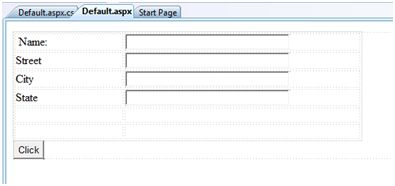

# HTML 服务器

HTML 服务器控件主要是保证服务端运行的增强型标准 HTML 控件。HTML 控件不是由服务器处理，而是被发送到浏览器进行显示，比如页面标题标签，链接标签及输入元素。

通过添加 runat = "server" 属性和一个 id 属性，它们可被特定地转化为一个服务器控件，应用于服务器端处理。

例如，HTML 输入控件：

```
<input type="text" size="40">
```

它可以通过添加 runat 和 id 属性被转换成一个服务器控件：

```
<input type="text" id="testtext" size="40" runat="server">
```

## 使用 HTML 服务器控件的优点

尽管 ASP.NET 服务器控件可以完成 HTML 服务器控件执行的每一项工作，HTML 控件在以下情况仍然具有优势：

- 使用静态表达到布局目的。
- 转换一个 HTML 页面到 ASP.NET 下运行。

下面这个表格介绍了 HTML 服务器控件：

<table>
<tr>
<th style="width:30%">控件名称</th>
<th>HTML 标签</th>
</tr>
<tr>
<td>HtmlHead </td>
<td>&lt;head&gt;element</td>
</tr>
<tr>
<td>HtmlInputButton</td>
<td>&lt;input type=button|submit|reset&gt;</td>
</tr>
<tr>
<td>HtmlInputCheckbox</td>
<td>&lt;input type=checkbox&gt;</td>
</tr>
<tr>
<td>HtmlInputFile</td>
<td>&lt;input type = file&gt;</td>
</tr>
<tr>
<td>HtmlInputHidden</td>
<td>&lt;input type = hidden&gt;</td>
</tr>
<tr>
<td>HtmlInputImage</td>
<td>&lt;input type = image&gt;</td>
</tr>
<tr>
<td>HtmlInputPassword</td>
<td>&lt;input type = password&gt;</td>
</tr>
<tr>
<td>HtmlInputRadioButton</td>
<td>&lt;input type = radio&gt;</td>
</tr>
<tr>
<td>HtmlInputReset</td>
<td>&lt;input type = reset&gt;</td>
</tr>
<tr>
<td>HtmlText</td>
<td>&lt;input type = text|password&gt;</td>
</tr>
<tr>
<td>HtmlImage</td>
<td>&lt;img&gt; element</td>
</tr>
<tr>
<td>HtmlLink</td>
<td>&lt;link&gt; element</td>
</tr>
<tr>
<td>HtmlAnchor</td>
<td>&lt;a&gt; element</td>
</tr>
<tr>
<td>HtmlButton</td>
<td>&lt;button&gt; element</td>
</tr>
<tr>
<td>HtmlButton</td>
<td>&lt;button&gt; element</td>
</tr>
<tr>
<td>HtmlForm</td>
<td>&lt;form&gt; element</td>
</tr>
<tr>
<td>HtmlTable</td>
<td>&lt;table&gt; element</td>
</tr>
<tr>
<td>HtmlTableCell</td>
<td>&lt;td&gt; and &lt;th&gt;</td>
</tr>
<tr>
<td>HtmlTableRow</td>
<td>&lt;tr&gt; element</td>
</tr>
<tr>
<td>HtmlTitle</td>
<td>&lt;title&gt; element</td>
</tr>
<tr>
<td>HtmlSelect</td>
<td>&lt;select&t; element</td>
</tr>
<tr>
<td>HtmlGenericControl</td>
<td>未列出的所有 HTML 控件</td>
</tr>
</table>


## 实例

以下实例使用了基本的 HTML 表格进行布局。它使用了用于从用户获得输入诸如姓名，地址，城市，州等的框，还有一个按钮控件，该控件被点击后能够获取该表最后一行中显示的用户数据。

页面在设计视图中应如下所示：



内容页面的代码表明了 HTML 表格元素进行布局的应用。

```
<%@ Page Language="C#" AutoEventWireup="true" CodeBehind="Default.aspx.cs" Inherits="htmlserver._Default" %>

<!DOCTYPE html PUBLIC "-//W3C//DTD XHTML 1.0 Transitional//EN" "http://www.w3.org/TR/xhtml1/DTD/xhtml1-transitional.dtd">

<html xmlns="http://www.w3.org/1999/xhtml" >

   <head runat="server">
      <title>Untitled Page</title>
      
      <style type="text/css">
         .style1
         {  
            width: 156px;
         }
         .style2
         {
            width: 332px;
         }
      </style>
      
   </head>
   
   <body>
      <form id="form1" runat="server">
         <div>
            <table style="width: 54%;">
               <tr>
                  <td class="style1">Name:</td>
                  <td class="style2">
                     <asp:TextBox ID="txtname" runat="server"  style="width:230px">
                     </asp:TextBox>
                  </td>
               </tr>
				
               <tr>
                  <td class="style1">Street</td>
                  <td class="style2">
                     <asp:TextBox ID="txtstreet" runat="server"  style="width:230px">
                     </asp:TextBox>
                  </td>
               </tr>
				
               <tr>
                  <td class="style1">City</td>
                  <td class="style2">
                     <asp:TextBox ID="txtcity" runat="server"  style="width:230px">
                     </asp:TextBox>
                  </td>
               </tr>
				
               <tr>
                  <td class="style1">State</td>
                  <td class="style2">
                     <asp:TextBox ID="txtstate" runat="server" style="width:230px">
                     </asp:TextBox>
                  </td>
               </tr>
				
               <tr>
                  <td class="style1"> </td>
                  <td class="style2"></td>
               </tr>
				
               <tr>
                  <td class="style1"></td>
                  <td ID="displayrow" runat ="server" class="style2">
                  </td>
               </tr>
            </table>
            
         </div>
         <asp:Button ID="Button1" runat="server" onclick="Button1_Click" Text="Click" />
      </form>
   </body>
</html>
```

按钮控件的后台代码为：

```
protected void Button1_Click(object sender, EventArgs e)
{
   string str = "";
   str += txtname.Text + "<br />";
   str += txtstreet.Text + "<br />";
   str += txtcity.Text + "<br />";
   str += txtstate.Text + "<br />";
   displayrow.InnerHtml = str;
}
```

观察以下陈述：

- 标准 HTML 标签已被使用进行页面布局。
- HTML 表格的最后一行用于数据显示。它需要服务器端进行加工，因此为其添加 ID 属性和 runat 属性。

