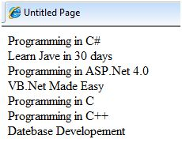
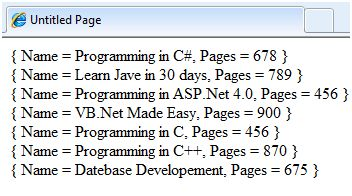
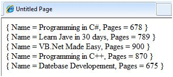
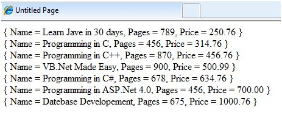
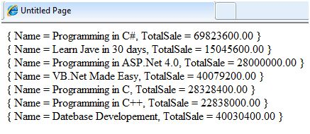

# ASP.NET - LINQ  

大多数应用都是以数据为中心的，然而大多数的数据仓库是关系型数据库。这些年，设计者和开发者设计了基于对象模型的应用程序。

对象来负责连接访问数据的组件——称为数据访问层( DAL )。这里我们需要考虑三点：  

- 一个应用程序所需要的所有数据可以不存储在一个资源中。这个资源可以是关系型数据库、业务对象、XML文件或者一个WEB服务器。
- 访问内存中的对象要比访问数据库、XML文件中的数据更简单，更廉价。  
- 被访问到的数据不是直接使用的，而是被转存、排序、分组、修改等。  

因此如果存在只是用几行代码就能实现轻易整合各种各样的数据——可以整合来自不同源的数据，并且能够执行基本的数据操作的工具，那将非常有用。  

语言集成查询( LINQ )就是上述那样的一种工具。 LINQ 是 .NET Framework 3.5 的一个扩展集并且它的管理语言使查询更类似于是一种对象。它定义了一种通用的语法和程序模型，使我们可以使用一种惯用的语法完成查找不同类型的数据。  

相关操作像查找、工程、链接、分组、分区、集合操作等可以在 LINQ 中使用，并且在 .NET Framework 3.5 中的 C# 和 VB 编译器支持 LINQ 的语法，这就使得它可以通过配置数据来存储，而不需要求助于 ADO.NET。

举个例子，在 Northwind 数据库中查询 Constomers 这张表，使用 C# 中的 LINQ ，代码应该是这样：  

```
var data = from c in dataContext.Customers
where c.Country == "Spain"
select c;
```

其中：  

- from关键字逻辑上依次通过每个集合。  
- 包含关键字where的表达式会比较集合中的每个对象。
- select声明会选择被比较出的对象加入到列表中并返回。
- 关键字var用于变量声明。因为返回对象的准确类型不明确，它表明信息需要被动态的推测。  

LINQ 查询语句可以应用在任何继承于 IEnumerable<T> 的有数据支撑的类，这里 T 可以是任何一个数据类型，例如 List< Book >。

让我们来看一个示例理解一下概念。示例中使用了如下类:Book.cs

```
public class Books
{
    public string ID {get; set;}
    public string Title { get; set; }
    public decimal Price { get; set; }
    public DateTime DateOfRelease { get; set; }

    public static List<Books> GetBooks()
    {
        List<Books> list = new List<Books>();
        list.Add(new Books { ID = "001", 
            Title = "Programming in C#", 
            Price = 634.76m, 
            DateOfRelease = Convert.ToDateTime("2010-02-05") });
     
        list.Add(new Books { ID = "002", 
            Title = "Learn Jave in 30 days", 
            Price = 250.76m, 
            DateOfRelease = Convert.ToDateTime("2011-08-15") });
     
        list.Add(new Books { ID = "003", 
            Title = "Programming in ASP.Net 4.0", 
            Price = 700.00m, 
            DateOfRelease = Convert.ToDateTime("2011-02-05") });
     
        list.Add(new Books { ID = "004", 
            Title = "VB.Net Made Easy", 
            Price = 500.99m, 
            DateOfRelease = Convert.ToDateTime("2011-12-31") });
     
        list.Add(new Books { ID = "005", 
            Title = "Programming in C", 
            Price = 314.76m, 
            DateOfRelease = Convert.ToDateTime("2010-02-05") });
     
        list.Add(new Books { ID = "006", 
            Title = "Programming in C++", 
            Price = 456.76m, 
            DateOfRelease = Convert.ToDateTime("2010-02-05") });
     
        list.Add(new Books { ID = "007", 
            Title = "Datebase Developement", 
            Price = 1000.76m, 
            DateOfRelease = Convert.ToDateTime("2010-02-05") });
         
        return list;
    }
}
```

在 web 网页中使用这个类要有简单的标签控制，来显示书的标题。Page_Load 方法创建了一个书的列表并且通过使用 LINQ 查询返回标题:

```
public partial class simplequery : System.Web.UI.Page
{
    protected void Page_Load(object sender, EventArgs e)
    {
        List<Books> books = Books.GetBooks();
        var booktitles = from b in books select b.Title;

        foreach (var title in booktitles)
            lblbooks.Text += String.Format("{0} <br />", title);
    }
}
```

当网页被运行，标签显示查询结果:  

  

上面的 LINQ 表达式:  

```
var booktitles = 
from b in books 
select b.Title;
```

等价于下述 SQL 语句:

```
SELECT Title from Books
```

## LINQ 运算符

除了到目前为止使用过的运算符之外，还有很多其他运算符来执行查询子句。我们来看一些运算符和子句。  

### join 子句

SQL 中的‘join clause’用来连接两个数据表并显示在两个数据表中都出现的列中的数据集合。LINQ 也可以支持这种功能。为了检测这一点，在之前的工程里增加另一个类名为 Saledetails.cs:  

```
public class Salesdetails
{
    public int sales { get; set; }
    public int pages { get; set; }
    public string ID {get; set;}

    public static IEnumerable<Salesdetails> getsalesdetails()
    { 
        Salesdetails[] sd = 
        {
            new Salesdetails { ID = "001", pages=678, sales = 110000},
            new Salesdetails { ID = "002", pages=789, sales = 60000},
            new Salesdetails { ID = "003", pages=456, sales = 40000},
            new Salesdetails { ID = "004", pages=900, sales = 80000},
            new Salesdetails { ID = "005", pages=456, sales = 90000},
            new Salesdetails { ID = "006", pages=870, sales = 50000},
            new Salesdetails { ID = "007", pages=675, sales = 40000},
        };
      
        return sd.OfType<Salesdetails>();
    }
}
```

在 Page_Load 函数中添加代码来用 join 子句处理在两张表里完成查询:  

```
protected void Page_Load(object sender, EventArgs e)
{
    IEnumerable<Books> books = Books.GetBooks();
    IEnumerable<Salesdetails> sales = Salesdetails.getsalesdetails();
   
    var booktitles = from b in books join s in sales on b.ID equals s.ID
        select new { Name = b.Title, Pages = s.pages };
      
    foreach (var title in booktitles)
        lblbooks.Text += String.Format("{0} <br />", title);
}
```

结果页显示如下：  

  

### where 子句  

where 子句允许在查询中添加筛选条件。例如，如果你想获得页数多于 500 的书目，可以改变 Page_Load 方法中的句柄成下述样子:

```
var booktitles = from b in books join s in sales on b.ID equals s.ID
    where s.pages > 500 select new { Name = b.Title, Pages = s.pages };
```

查询语句只返回那些页数大于 500 的列:  

  

### 正序倒序排序子句

这些子句允许将查询结果进行排序。为了查询出标题、页数和书的价格，并且按照价格排序，在 Page_Load 方法中的句柄里写如下代码:  

```
var booktitles = from b in books join s in sales on b.ID equals s.ID
    orderby b.Price select new { Name = b.Title,  Pages = s.pages, Price = b.Price};
```

返回的元组是：  

  

### Let 子句

let 子句允许定义一个变量并且将数据计算的一个值赋给它。举个例子，计从上述两个销售值中计算总销售值，你需要这样计算:

```
TotalSale = Price of the Book * Sales
```

为了完成这个算式，加入下面这个代码片段在 Page_Load 方法的句柄里:  

let 子句允许定义一个变量并且将数据计算的一个值赋给它。举个例子，计从上述两个销售值中计算总销售值，你需要这样计算:

```
var booktitles = from b in book join s in sales on b.ID equals s.ID
   let totalprofit = (b.Price * s.sales)
   select new { Name = b.Title, TotalSale = totalprofit};
```

查询结果如下图所示：  

  


