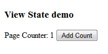
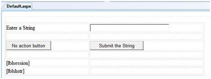
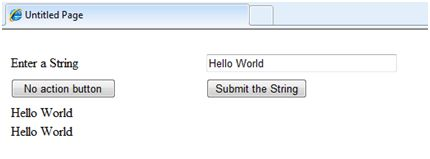

# ASP.NET - 管理状态

超文本传输协议(HTTP)是一种无状态协议。当客户端从服务器断开连接时，ASP.NET 引擎将丢弃页面对象。这样一来，每个 Web 应用程序能够扩展到同时服务于大量请求而不会耗尽服务器内存。

然而，需要有一些技术来存储各个请求之间的信息并在需要时取回。这个信息则称为状态，即所有控件的当前值和在当前会话中当前用户使用的变量。

ASP.NET 管理四种状态：

- 视图状态
- 控制状态
- 会话状态
- 应用程序状态

## 视图状态

视图状态是页面及其所有控件的状态。它通过 ASP.NET 框架的反馈保持不变。

当一个页面被发送回客户端，这些页面变化的属性及其控件是确定的，并存储在名为 _VIEWSTATE 的一个隐藏输入字段的值内。当页面被再次回发时，_VIEWSTATE 字段随 HTTP 请求被发送到服务器。

视图状态可以对以下内容启用或者禁用：

- **整个应用程序**：设置 web.config 文件中 <pages> 部分的 EnableViewState 属性。
- **一个页面**：设置页面指令的 EnableViewState 属性为 <%@ Page Language="C#" EnableViewState="false" %>
- **一个控件**：设置控件 .EnableViewState 属性。

它通过使用视图状态对象，该对象是由被一组视图状态项目定义的 StateBag 类别定义的。该 StateBag 是一种数据结构，包含属性值对并被存储为与对象相关联的字符串。

StateBag 类具有以下属性：

|属性|描述|
|:----|:---|
|Item(name)|具有指定名称的视图状态的值，是 StateBag 的默认属性。|
|Count|状态集合中的项目名称。|
|Keys|集合中所有项目的密钥集合。|
|Values|集合中所有项目的值的集合。|

StateBag 类具有以下方法：

|方法|描述|
|:----|:---|
|Add(name, value)|添加一个项目到视图状态集合，更新现有项目。|
|Clear|移除集合中所有项目。|
|Equals(Object)|确定指定的对象是否等于当前对象。|
|Finalize|允许释放资源并执行其他清理操作。|
|GetEnumerator|返回存储在 StateBag 对象中重复的 StateItem 对象的密钥/值对的计数器。|
|GetType|获取当前实例的类型。|
|IsItemDirty|检查存储在 StateBag 对象以确认其是否已被修改。|
|Remove(name)|移除制定项目。|
|SetDirty|设置 StateBag 对象的状态以及每个由其包含的 StateItem 对象的 Dirty 属性。|
|SetItemDirty|为在 StateBag 对象中的指定 StateItem 对象设置 Dirty 属性。
|ToString|返回代表状态包对象的字符串。|

## 实例

以下实例说明了存储视图状态的字符串的概念。

让我们保持一个计数器，通过点击页面上的一个按钮，该计数器能够在每次页面被调回时递增。标签控件显示计数器的值。

标记文件代码如下所示：

```
<%@ Page Language="C#" AutoEventWireup="true" CodeBehind="Default.aspx.cs" Inherits="statedemo._Default" %>

<!DOCTYPE html PUBLIC "-//W3C//DTD XHTML 1.0 Transitional//EN" "http://www.w3.org/TR/xhtml1/DTD/xhtml1-transitional.dtd">

<html xmlns="http://www.w3.org/1999/xhtml" >

   <head runat="server">
      <title>
         Untitled Page
      </title>
   </head>
   
   <body>
      <form id="form1" runat="server">
      
         <div>
            <h3>View State demo</h3>
         
            Page Counter:
            
            <asp:Label ID="lblCounter" runat="server" />
            <asp:Button ID="btnIncrement" runat="server" Text="Add Count" onclick="btnIncrement_Click" />
         </div>
         
      </form>
   </body>
   
</html>
```

该实例的后台代码文件如下所示：

```
public partial class _Default : System.Web.UI.Page
{
   public int counter
   {
      get
      {
         if (ViewState["pcounter"] != null)
         {
            return ((int)ViewState["pcounter"]);
         }
         else
         {
            return 0;
         }
      }
      
      set
      {
         ViewState["pcounter"] = value;
      }
   }
        
   protected void Page_Load(object sender, EventArgs e)
   {
      lblCounter.Text = counter.ToString();
      counter++;
   }
}
```

它将会生成以下结果：



## 控制状态

控制状态不能被直接修改，存取或禁用。

## 会话状态

当用户连接到 ASP.NET 网站，一个新的会话对象将被创建。当会话状态开启时，新的会话状态会为每一个新的请求而创建。这种会话状态对象会成为运行环境中的一部分并可通过页面使用。

会话状态通常用于存储应用程序数据，比如详细目录，供应商清单，客户记录或购物车。它可以存储用户的信息及其偏好信息，并保存用户未决定的路径。

会话由 120 位的 SessionID 识别和跟踪，从客户端传递到服务器并且作为 cookie 或修改的 URL 回传。SessionID 是全球唯一的，随机的。

会话状态对象由 HttpSessionState 类创建，它定义会话状态项集合。

HttpSessionState 类具有以下属性：

|属性|描述|
|:----|:---|
|SessionID|唯一的会话标识符。|
|Item(name)|具有指定名称的会话状态项的值，是 HttpSessionState 类的默认属性。|
|Count|会话状态集合中项的数量。|
|TimeOut|获取和设置时间量，几分钟内，在供应商停止会话状态前在请求间被允许。|

HttpSessionState 类有以下方法：

|方法|描述|
|:----|:---|
|Add(name, value)|添加新的项到会话状态集合。|
|Clear|移除会话状态集合中所有项。|
|Remove(name)|移除会话状态集合中的指定项。|
|RemoveAll|移除会话状态集合中所有密钥和值。|
|RemoveAt|从会话状态集合中删除指定索引处的项。|

会话状态对象是一个名 - 值对，它可以从会话状态对象中存储和检索信息。同样地，您可以使用以下代码：

```
void StoreSessionInfo()
{
   String fromuser = TextBox1.Text;
   Session["fromuser"] = fromuser;
}

void RetrieveSessionInfo()
{
   String fromuser = Session["fromuser"];
   Label1.Text = fromuser;
}
```

以上代码只存储在会话词典对象中的字符串，但是，它可以存储所有原始数据类型和由原始数据类型组成的阵列，DataSet, DataTable, HashTable, 和图像对象，以及继承 ISerializable 对象的任意用户定义的类。

### 实例

以下实例说明了存储会话状态的概念。在页面上有两个按钮：输入字符串的文本框按钮和显示从最后一个会话中存储的文本的标签按钮。
标记文件代码如下所示：

```
<%@ Page Language="C#" AutoEventWireup="true"  CodeFile="Default.aspx.cs" Inherits="_Default"  %>

<!DOCTYPE html PUBLIC "-//W3C//DTD XHTML 1.0 Transitional//EN" "http://www.w3.org/TR/xhtml1/DTD/xhtml1-transitional.dtd">

<html xmlns="http://www.w3.org/1999/xhtml" >

   <head runat="server">
      <title>
         Untitled Page
      </title>
   </head>
   
   <body>
      <form id="form1" runat="server">
         <div>
            &nbsp; &nbsp; &nbsp;
            
            <table style="width: 568px; height: 103px">
            
               <tr>
                  <td style="width: 209px">
                     <asp:Label ID="lblstr" runat="server" Text="Enter a String"  style="width:94px">
                     </asp:Label>
                  </td>
					
                  <td style="width: 317px">
                     <asp:TextBox ID="txtstr" runat="server" style="width:227px">
                     </asp:TextBox>
                  </td>
               </tr>
	
               <tr>
                  <td style="width: 209px"> </td>
                  <td style="width: 317px"> </td>
               </tr>
	
               <tr>
                  <td style="width: 209px">
                     <asp:Button ID="btnnrm" runat="server" 
                        Text="No action button" style="width:128px" />
                  </td>
	
                  <td style="width: 317px">
                     <asp:Button ID="btnstr" runat="server" 
                        OnClick="btnstr_Click" Text="Submit the String" />
                  </td> 
               </tr>
	
               <tr>
                  <td style="width: 209px">  </td>
	
                  <td style="width: 317px">  </td>  
               </tr>
	
               <tr>
                  <td style="width: 209px">
                     <asp:Label ID="lblsession" runat="server"  style="width:231px"  >
                     </asp:Label>
                  </td>
	
                  <td style="width: 317px">  </td>
               </tr>
	
               <tr>
                  <td style="width: 209px">
                     <asp:Label ID="lblshstr" runat="server">
                     </asp:Label>
                  </td>
	
                  <td style="width: 317px">  </td>
               </tr>
               
            </table>
            
         </div>
      </form>
   </body>
</html>
```

在设计视图中应有如下显示：



后台代码如下：

```
public partial class _Default : System.Web.UI.Page 
{
   String mystr;
   
   protected void Page_Load(object sender, EventArgs e)
   {
      this.lblshstr.Text = this.mystr;
      this.lblsession.Text = (String)this.Session["str"];
   }
   
   protected void btnstr_Click(object sender, EventArgs e)
   {
      this.mystr = this.txtstr.Text;
      this.Session["str"] = this.txtstr.Text;
      this.lblshstr.Text = this.mystr;
      this.lblsession.Text = (String)this.Session["str"];
   }
}
```

执行文件并观察其如何运行：



## 应用程序状态

ASP.NET 应用程序是在 Web 服务器上所有网页，代码和单个虚拟目录的其他文件的集合。当信息被存储在应用程序状态，它可以供所有用户使用。

为了提供应用程序状态的使用，ASP.NET 从 HttpApplicationState 类中为每个应用程序创建一个应用程序状态对象，并将该对象存储在服务器内存中。该对象是由类文件 global.asax 表示。

应用程序状态主要被用于存储计数器，其他统计数据及税率，折扣率等所有应用程序数据，并存储用户访问网站的路径。

HttpApplicationState 类具有以下属性：

|属性|描述|
|:----|:---|
|Item(name)|具有指定名称的应用程序项的值，是 HttpApplicationState 的默认属性。|
|Count|应用程序状态集合中项的数量。|

HttpApplicationState 类具有以下方法：

|方法|描述|
|:----|:---|
|Add(name, value)|添加新的项目到应用程序状态集合。
|Clear|移除应用程序状态集合中的所有项。|
|Remove(name)|移除应用程序状态集合中的指定项。|
|RemoveAll|移除一个 HttpApplicationState 集合中所有对象。|
|RemoveAt|移除从由索引找到的集合中的一个 HttpApplicationState 对象。|
|Lock()|锁定应用程序状态集合以便只有当前用户可以访问。|
|Unlock()|解锁应用程序状态集合以便所有用户可以访问。|

应用程序状态的数据通常是由为事件编写的处理程序维护：

- 应用程序开启
- 应用程序结束
- 应用程序错误
- 会话开始
- 会话结束

以下代码片段展示了用于存储应用程序状态信息的基本语法：

```
Void Application_Start(object sender, EventArgs e)
{
   Application["startMessage"] = "The application has started.";
}

Void Application_End(object sender, EventArgs e)
{
   Application["endtMessage"] = "The application has ended.";
}
```
