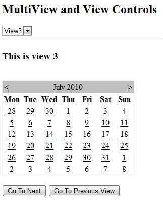

MultiView 和 View 控件允许你将一个页面的内容分成不同的组，一次只显示一组。每个视图控件管理一个组的内容，并且所有视图控件包括在 MultiView 控件中。

多视图控件一次只负责显示一个视图。视图显示称为活动视图。

MultiView 控件的语法是：

```
<asp:MultView ID= "MultiView1" runat= "server">
</asp:MultiView>
```

View 控制的语法是：

```
<asp:View ID= "View1" runat= "server">
</asp:View>
```

然而，该控件不能自行存在。如果您尝试单独使用它会出现错误。它总是和一个多视点控制器一起使用：

```
<asp:MultView ID= "MultiView1" runat= "server">
   <asp:View ID= "View1" runat= "server"> </asp:View>
</asp:MultiView>
```

## View 和 MultiView 控件的属性

视图和多视图控件都来源于 Control 类。并继承其所有属性、方法和事件。视图控件的最重要属性是可视布尔属性，它设置了一个视图的可见性。

多视图控件具有以下重要特性：

|属性|描述|
| ------------- |:-------------:| 
|Views|集多视图在内的视图控件|
|ActiveViewIndex|从零开始的索引，它表示该活动视图。如果没有视图处于活动状态，那么索引值为 -1 |

与 MultiView 控件的导航相关的按钮控制 CommandName 属性都与 MultiView 控件的一些相关字段关联。

例如，如果一个按钮控制的 CommandName 值作为与多视图的导航相关，单击按钮时它会自动导航到下一个视图中。

下表显示了上述属性的默认命令名：

|元素|描述|
| ------------- |:-------------:| 
|NextViewCommandName|下一视图|
|PreviousViewCommandName|上一视图|
|SwitchViewByIDCommandName|SwitchViewByID|
|SwitchViewByIndexCommandName|SwitchViewByIndex|

多视点控制的重要方法是：

|方法|描述|
| ------------- |:-------------:| 
|SetActiveview|设置活动视图|
|GetActiveview|检索活动视图|

每一个视图改变时，页面被回传到服务器，同时一些事件被引发。一些重要的事件是：

|事件|描述|
| ------------- |:-------------:| 
|ActiveViewChanged|当一个视图发生改变时触发|
|Activate|通过活跃视图触发|
|Deactivate|通过不活跃视图触发|

除了上面提到的属性、方法和事件，多视图控件继承了控制和对象类的成员。

## 例子

示例页面有三个视图。每个视图的导航视图有两个按钮。

内容文件的代码如下：

```
<%@ Page Language="C#" AutoEventWireup="true" CodeBehind="Default.aspx.cs" Inherits="multiviewdemo._Default" %>

<!DOCTYPE html PUBLIC "-//W3C//DTD XHTML 1.0 Transitional//EN" "http://www.w3.org/TR/xhtml1/DTD/xhtml1-transitional.dtd">

<html xmlns="http://www.w3.org/1999/xhtml" >

   <head runat="server">
      <title>
         Untitled Page
      </title>
   </head>
   
   <body>
      <form id="form1" runat="server">
      
         <div>
            <h2>MultiView and View Controls</h2>
            
            <asp:DropDownList ID="DropDownList1" runat="server" onselectedindexchanged="DropDownList1_SelectedIndexChanged">
            </asp:DropDownList>
            
            <hr />
            
            <asp:MultiView ID="MultiView1" runat="server" ActiveViewIndex="2"  onactiveviewchanged="MultiView1_ActiveViewChanged" >
               <asp:View ID="View1" runat="server">
                  <h3>This is view 1</h3>
                  <br />
                  <asp:Button CommandName="NextView" ID="btnnext1" runat="server" Text = "Go To Next" />
                  <asp:Button CommandArgument="View3" CommandName="SwitchViewByID" ID="btnlast" runat="server" Text  ="Go To Last" />
               </asp:View> 
					
               <asp:View ID="View2" runat="server">
                  <h3>This is view 2</h3>
                  <asp:Button CommandName="NextView" ID="btnnext2" runat="server" Text = "Go To Next" />
                  <asp:Button CommandName="PrevView" ID="btnprevious2" runat="server" Text = "Go To Previous View" />
               </asp:View> 

               <asp:View ID="View3" runat="server">
                  <h3> This is view 3</h3>
                  <br />
                  <asp:Calendar ID="Calender1" runat="server"></asp:Calendar>
                  <br />
                  <asp:Button  CommandArgument="0" CommandName="SwitchViewByIndex" ID="btnfirst"   runat="server" Text = "Go To Next" />
                  <asp:Button CommandName="PrevView" ID="btnprevious" runat="server" Text = "Go To Previous View" />
               </asp:View> 
               
            </asp:MultiView>
         </div>
         
      </form>
   </body>
</html>
```

注意以下事项：

MultiView.ActiveViewIndex 确定了哪些视图将要显示。这是页面上呈现的唯一视图。没有视图显示时 ActiveViewIndex 的默认值是 -1。 由于范例中 ActiveViewIndex 被定义为 2，所以被执行时它显示的是第三个视图。


