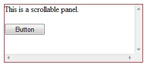
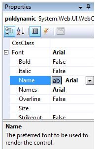
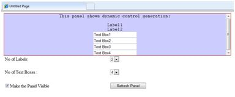

# ASP.NET - Panel 控件

Panel 控件可以作为一个页面上的其他控件的容器。它控制其包含的控件的外观和可视度。它还允许生成控件编程。

面板控件的基本语法如下：

```
<asp:Panel ID= "Panel1"  runat = "server">
</asp:Panel>
```

面板控件从 WebControl 类派生。因此，它同样地继承了所有的属性、方法和事件。它不具有任何自己的方法或事件。然而，它有自己的以下属性：

|**属性**|**描述**|
|:------------- |:-------------| 
|BackImageUrl|面板背景图像的地址。|
|DefaultButton|获取或设置包含在 Panel 控件的默认按钮的标识符。|
|Direction|面板中的文本方向。|
|GroupingText|允许文本作为一个字段分组。|
|HorizontalAlign|水平对齐面板中的内容。|
|ScrollBars|指定面板内滚动条的可见性和位置。|
|Wrap|允许文本换行。|

## 使用面板控件

让我们从一个具体的高度和宽度、边框样式简单的滚动面板开始。滚动条属性设置为两个滚动条，因此两个滚动条同时被呈现。滚动条属性设置为两个滚动条，因此两个滚动条同时被呈现。

源文件具有如下的面板标签代码：

```
<asp:Panel ID="Panel1" runat="server" BorderColor="#990000" BorderStyle="Solid" 
   Borderstyle="width:1px" Height="116px" ScrollBars="Both" style="width:278px">
   
   This is a scrollable panel.
   <br />
   <br />

   <asp:Button ID="btnpanel" runat="server" Text="Button" style="width:82px" />
</asp:Panel>
```

面板呈现如下：




## 例子

下面的例子演示了动态内容生成。用户提供要在面板上产生的标签控件和文本框的数目。控件以编程方式生成。

用属性窗口更改面板属性。当您在设计视图中选择一个控件时，该属性窗口中将显示特定控件的属性，并允许您更改，而无需键入。



示例的源文件如下：

```
<form id="form1" runat="server">
   <div>
      <asp:Panel ID="pnldynamic" runat="server" BorderColor="#990000" 
         BorderStyle="Solid" Borderstyle="width:1px" Height="150px"  ScrollBars="Auto" style="width:60%" BackColor="#CCCCFF"  Font-Names="Courier" HorizontalAlign="Center">
     
         This panel shows dynamic control generation:
         <br />
         <br />
      </asp:Panel>
   </div>

   <table style="width: 51%;">
      <tr>
         <td class="style2">No of Labels:</td>
         <td class="style1">
            <asp:DropDownList ID="ddllabels" runat="server">
               <asp:ListItem>0</asp:ListItem>
               <asp:ListItem>1</asp:ListItem>
               <asp:ListItem>2</asp:ListItem>
               <asp:ListItem>3</asp:ListItem>
               <asp:ListItem>4</asp:ListItem>
            </asp:DropDownList>
         </td>
      </tr>

      <tr>
         <td class="style2"> </td>
         <td class="style1"> </td>
      </tr>

      <tr>
         <td class="style2">No of Text Boxes :</td>
         <td class="style1">
            <asp:DropDownList ID="ddltextbox" runat="server">
               <asp:ListItem>0</asp:ListItem>
               <asp:ListItem Value="1"></asp:ListItem>
               <asp:ListItem>2</asp:ListItem>
               <asp:ListItem>3</asp:ListItem>
               <asp:ListItem Value="4"></asp:ListItem>
            </asp:DropDownList>
         </td>
      </tr>

      <tr>
         <td class="style2"> </td>
         <td class="style1"> </td>
      </tr>

      <tr>
         <td class="style2">
            <asp:CheckBox ID="chkvisible" runat="server" 
               Text="Make the Panel Visible" />
         </td>

         <td class="style1">
            <asp:Button ID="btnrefresh" runat="server" Text="Refresh Panel" 
               style="width:129px" />
         </td>
      </tr>
   </table>
</form>
```

在 Page_Load 事件背后的负责动态生成的控件的源代码为：

```
public partial class _Default : System.Web.UI.Page
{
   protected void Page_Load(object sender, EventArgs e)
   {
      //make the panel visible
      pnldynamic.Visible = chkvisible.Checked;

      //generating the lable controls:
      int n = Int32.Parse(ddllabels.SelectedItem.Value);
      for (int i = 1; i <= n; i++)
      {
         Label lbl = new Label();
         lbl.Text = "Label" + (i).ToString();
         pnldynamic.Controls.Add(lbl);
         pnldynamic.Controls.Add(new LiteralControl("<br />"));
      }
      
      //generating the text box controls:

      int m = Int32.Parse(ddltextbox.SelectedItem.Value);
      for (int i = 1; i <= m; i++)
      {
         TextBox txt = new TextBox();
         txt.Text = "Text Box" + (i).ToString();
         pnldynamic.Controls.Add(txt);
         pnldynamic.Controls.Add(new LiteralControl("<br />"));
      }
   }
}
```

当被执行时，面板呈现为：


