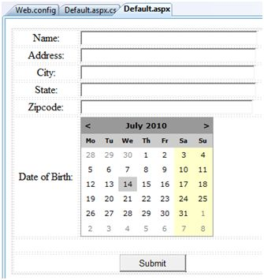

# ASP.NET - 个性化  

网站是为用户的重复访问而设计的。个性化允许一个网站记住用户标识和其他信息细节，并且它给每个用户提供了一个个人的环境。  

ASP.NET 为满足特性客户的品味和喜好而个性化一个网站提供服务。  

## 理解特征文件  

ASP.NET 个性化服务基于用户的特征文件。用户特征文件定义了该网站需要用户的信息。例如，名字，年龄，地址，出生日期和手机号码。  

这个信息被定义在应用程序的 web.config 文件中并且 ASP.NET 运行时间阅读并使用它。这个工作由个性化提供者所完成。  

用户数据所含有的用户特征文件被存储在默认的 ASP.NET 创建的数据库中。你可以创建你自己的数据库来存储特征文件。特征文件数据定义被存储在配置文件 web.config 中。  

### 例子  

让我们创建一个样本网站，那里我们想要我们的应用程序记住用户细节，像名字，地址，出生日期等。在 web.config 文件中用 <system.web> 元素添加特征文件细节。  

```
<configuration>
<system.web>

<profile>
   <properties>
      <add name="Name" type ="String"/>
      <add name="Birthday" type ="System.DateTime"/>
      
      <group name="Address">
         <add name="Street"/>
         <add name="City"/>
         <add name="State"/>
         <add name="Zipcode"/>
      </group>
      
   </properties>
</profile>

</system.web>
</configuration>
```  

当特征文件在 web.config 文件中被定义时，特征文件可以通过在当前的 HttpContext 中找到的 Profile 属性使用并且通过页面获得。  

添加 text box 来获取在特征文件中定义的用户输入，添加一个　button 来提交数据：  

  

更新 Page_load 来展示特征文件信息：  

```
using System;
using System.Data;
using System.Configuration;

using System.Web;
using System.Web.Security;

using System.Web.UI;
using System.Web.UI.WebControls;
using System.Web.UI.WebControls.WebParts;
using System.Web.UI.HtmlControls;

public partial class _Default : System.Web.UI.Page 
{
   protected void Page_Load(object sender, EventArgs e)
   {
      if (!this.IsPostBack)
      {
         ProfileCommon pc=this.Profile.GetProfile(Profile.UserName);
         
         if (pc != null)
         {
            this.txtname.Text = pc.Name;
            this.txtaddr.Text = pc.Address.Street;
            this.txtcity.Text = pc.Address.City;
            this.txtstate.Text = pc.Address.State;
            this.txtzip.Text = pc.Address.Zipcode;
            this.Calendar1.SelectedDate = pc.Birthday;
         }
      }
   }
}
```  

为提交按钮写以下的句柄，将用户数据存入特征文件中：  

```
protected void btnsubmit_Click(object sender, EventArgs e)
{
   ProfileCommon pc=this.Profile.GetProfile(Profile.UserName);
   
   if (pc != null)
   {
      pc.Name = this.txtname.Text;
      pc.Address.Street = this.txtaddr.Text;
      pc.Address.City = this.txtcity.Text;
      pc.Address.State = this.txtstate.Text;
      pc.Address.Zipcode = this.txtzip.Text;
      pc.Birthday = this.Calendar1.SelectedDate;
      
      pc.Save();
   }
}
```  

当页面第一次执行时，用户需要输入信息。但是，下一次用户的细节将被自动加载。  

## <add>元素的属性  

除了我们已经使用过的名字和类型属性，<add>元素还有其它属性。以下的表格展示了这些属性中的一些：  

|**属性**|**描述**|
|:-----|:-----|
|name|属性的名字。|
|type|类型默认是 string 但是它允许任何完全的类名称作为数据类型。|
|serializeAS|当序列化这个值时使用的格式。|
|readOnly|只读的特征文件值不能被改变，这个属性默认是 false。|
|defaultValue|一个默认的值，如果特征文件不存在或者没有信息的话它被使用。|
|allowAnonymous|一个指示这个属性是否能和匿名文件使用的布尔值。|
|Provider|应该被用来管理这个属性的特征文件提供者。|  

## 匿名个性化  

匿名个性化允许用户在标识它们自己之前个性化网站。例如，Amazon.com 允许用户在登录前在购物车中添加物品。为了启用此功能，web.config 文件可以被配置成以下：  

```
<anonymousIdentification enabled ="true" cookieName=".ASPXANONYMOUSUSER"
   cookieTimeout="120000" cookiePath="/" cookieRequiresSSL="false"
   cookieSlidingExpiration="true" cookieprotection="Encryption"
   coolieless="UseDeviceProfile"/>
```
