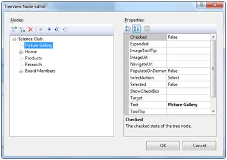
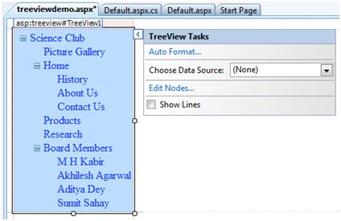
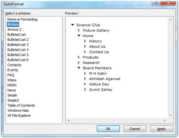
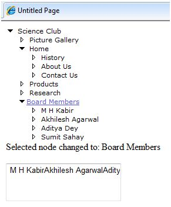

# ASP.NET - 服务器控件

控件是在图形用户界面中的小功能块，其中包括文本框，按钮，复选框，列表框，标签，和许多其它工具。利用这些工具，用户可以输入数据，进行选择并注明自己的喜好。

控件也用于结构性工作，如验证，数据访问，安全保证，创建母版页和数据操作。

ASP.NET 使用五种类型的 Web 控件，它们是：

- HTML 控件
- HTML 服务器控件
- ASP.NET 服务器控件
- ASP.NET Ajax 服务器控件
- 用户控件和自定义控件

ASP.NET 服务器控件是在 ASP.NET 中使用的主要控件。这些控件可被分成以下几类：

- **验证控件** - 用来验证用户输入，并通过运行客户端脚本进行工作。
- **数据源控件** - 提供数据绑定到不同的数据源功能。
- **数据视图控件** - 该控件为各种列表和表格，可以显示从数据源绑定的数据。
- **个性化控件** - 根据用户的喜好，基于用户信息进行页面个性化设置。
- **登陆和安全控件** - 提供用户身份验证。
- **母版页** - 提供整个应用程序一致的布局和界面。
- **导航控件** - 帮助用户导航。例如，菜单，树视图等。
- **丰富功能控件** - 实施特殊功能。例如：AdRotator, FileUpload, 和日历控件。

使用服务器控件的基本语法是：

```
<asp:controlType  ID ="ControlID" runat="server" Property1=value1  [Property2=value2] />
```

此外，Visual Studio还具有以下特点，以帮助产生无差错代码：

- 在设计视图中拖动和丢弃控件。
- 显示及自动完成特性的智能感知功能。
- 直接设置属性值的属性窗口。

## 服务器控件的属性

具有可视化功能的 ASP.NET 服务器控件来源于 WebControl 类，并且继承该类别的所有属性，事件以及方法。

WebControl 类本身以及其他不具有可视化功能的服务器控件都来源于 System.Web.UI.Control 类。例如，PlaceHolder 控件或 XML 控件。

ASP.Net 服务器控件继承了 WebControl 和 System.Web.UI.Control 类的所有属性，事件，以及方法。

下表显示了通用于所有服务器控件的属性：

|属性|描述|
|:----|:---|
|AccessKey|同时按下该按键以及 Alt 键以将焦点移至控件。|
|Attributes|它是不对应控件属性的任意属性（仅用于视图呈现）的集合。|
|BackColor|背景色。|
|BindingContainer|包含数据绑定的控件。|
|BorderColor|边框颜色。|
|BorderStyle|边框样式。|
|BorderWidth|边框宽度。|
|CausesValidation|引起验证时显示。|
|ChildControlCreated|表示服务器控件的子控件是否建立。|
|ClientID|HTML 标记的控件 ID。|
|Context|与服务器控件关联的 HttpContext 对象。|
|Controls|控件内全部控件的集合。|
|ControlStyle|Web 服务器控件的样式。|
|CssClass|CSS 类。|
|DataItemContainer|若命名器执行 IDataItemContainer，则为命名器提供参考。|
|DataKeysContainer|若命名器执行 IDataKeysControl，则为命名器提供参考。|
|DesignMode|表示控件在设计界面是否被使用。|
|DisabledCssClass|当控件禁用时，获取或设置 CSS 类来应用呈现的 HTML 元素。
|Enabled|表示控件是否被禁用。|
|EnableTheming|表示主题是否适用于控件。|
|EnableViewState|表示是否维持控件的视图状态。|
|Events|获取代表控件的事件处理程序的列表。|
|Font|字体设定。|
|Forecolor|前景颜色。|
|HasAttributes|表示控件是否具有属性组。|
|HasChildViewState|表示当前服务器控件的子控件是否具有任何已保存的视图状态设置。|
|Height|高度的像素或百分比。|
|ID|控件的标识符。|
|IsChildControlStateCleared|表示包含在该控件内部的控件是否具有控件状态。|
|IsEnabled|获取表示控件是否被启用的值。|
|IsTrackingViewState|表示服务器控件是否会将更改保存到其视图状态。|
|IsViewStateEnabled|表示视图状态是否对该控件启用。|
|LoadViewStateById|表示控件是否是由 ID 而非索引来参与加载其视图状态。|
|Page|包含控件的页面。|
|Parent|家长控制功能。|
|RenderingCompatibility|指定呈现的 HTML 将与之兼容的 ASP.NET 版本。|
|Site|当设计界面显示时容纳当前控件的承载器。|
|SkinID|获取或设置适用于控件的皮肤。|
|Style|获取将在 Web 服务器控件的外部标签作为样式属性显示的文本属性的集合。|
|TabIndex|获取或设置 Web 服务器控件的索引标签。|
|TagKey|获取对应该 Web 服务器控件的 HtmlTextWriterTag 值。|
|TagName|获取控件标签的名称。|
|TemplateControl|包含该控件的模板。|
|TemplateSourceDirectory|获取页面的虚拟目录或包含在该控件中的控件。|
|ToolTip|获取或设置当鼠标指针停在 Web 服务器控件时显示的文本。|
|UniqueID|唯一的标识符。|
|ViewState|获取能够穿越同一页面的多重请求后保存和恢复服务器控件视图状态的状态信息词典。|
|ViewStateIgnoreCase|表示 StateBag 对象是否不区分大小写。|
|ViewStateMode|获取或设置该控件的视图状态。|
|Visible|表示服务器控件是否可见。|
|Width|获取或设置 Web 服务器控件的宽度。|

## 服务器控件的方法

服务器控件的方法在以下表格中呈现：

|方法|描述|
|:----|:---|
|AddAttributesToRender|添加需要呈现指定 HtmlTextWriterTag 的 HTML 属性和样式。|
|AddedControl|在子控件添加到控件对象的控件集合后调用。|
|AddParsedSubObject|通报服务器控件一个元素，XML 或 HTML 已被解析，并将该元素添加到服务器控件的控件集合。|
|ApplyStyleSheetSkin|将在页面样式表中定义的样式属性应用到控件中。|
|ClearCachedClientID|基础设施。设置缓存的 ClientID 值设置为 null。|
|ClearChildControlState|为服务器控件的子控件删除控件状态信息。|
|ClearChildState|为所有服务器控件的子控件删除视图状态和控件状态信息。|
|ClearChildViewState|为所有服务器控件的子控件删除视图状态信息。|
|CreateChildControls|用于创建子控件。|
|CreateControlCollection|创建一个用于保存子控件的新控件集合。|
|CreateControlStyle|创建一个用于实现所有与样式有关的属性的样式对象。|
|DataBind|将数据源绑定到服务器控件及其所有子控件。|
|DataBind(Boolean)|将数据源及可以引发 DataBinding 事件的选项绑定到服务器控件及其所有子控件。|
|DataBindChildren|将数据源绑定到服务器控件的子控件。|
|Dispose|启用一个服务器控件在其从内存中释放出来前去执行最后的清理操作。|
|EnsureChildControls|确定服务器控件是否包含子控件。若没有，则创建子控件。|
|EnsureID|为没有标识符的控件创建一个标识符。|
|Equals(Object)|确定指定对象是否等于当前对象。|
|Finalize|允许一个对象去尝试释放资源并在对象被回收站回收前执行其他清理操作。|
|FindControl(String)|搜索当前命名容器中具有指定 id 参数的服务器控件。|
|FindControl(String, Int32)|搜索当前命名容器中具有指定 id 参数和整数的服务器控件。|
|Focus|为控件设置输入焦点。|
|GetDesignModeState|获取控件的设计时数据。|
|GetType|获取当前实例的类型。|
|GetUniqueIDRelativeTo|返回指定控件的唯一 ID 属性的预固定部分。|
|HasControls|确定服务器控件是否包含子控件。|
|HasEvents|表示事件是否被控件或其他子控件注册。|
|IsLiteralContent|确定服务器控件是否仅含有文字内容。|
|LoadControlState|恢复控件状态信息。|
|LoadViewState|恢复视图状态信息。|
|MapPathSecure|检索绝对的或相对的虚拟路径映射到的物理路径。|
|MemberwiseClone|创建当前对象的浅复制。|
|MergeStyle|复制指定样式的 Web 控件的任意非空白元素，但不覆盖该控件现有的任何样式元素。|
|OnBubbleEvent|确定服务器控件的事件是否通过页面的 UI 服务器控件层级。|
|OnDataBinding|引发数据绑定事件。|
|OnInit|引发 Init 事件。|
|OnLoad|引发加载事件。|
|OnPreRender|引发 PreRender 事件。|
|OnUnload|引发卸载事件。|
|OpenFile|获取用于读取文件的流。|
|RemovedControl|在子控件从控件对象的控件集合中移除后调用。|
|Render|显示控件到指定的 HTML 作者。|
|RenderBeginTag|显示控件的 HTML 开口标签到指定作者。|
|RenderChildren|输出服务器控件子级的内容到提供的 HtmlTextWriter 对象中，从而编写呈现在客户端上的内容。|
|RenderContents|显示控件内容到指定作者。|
|RenderControl(HtmlTextWriter)|输出服务器控件内容到提供的 HtmlTextWriter 对象并在启用跟踪的情况下保存关于控件的跟踪信息。|
|RenderEndTag|显示控件的 HTML 结束标签到指定作者。|
|ResolveAdapter|获取负责呈现指定控件的控件适配器。|
|SaveControlState|保存自页面回发到服务器后出现的服务器控件的状态改变。|
|SaveViewState|保存调用 TrackViewState 方法之后修改的任意状态。|
|SetDesignModeState|为控件设置设计时数据。|
|ToString|返回代表当前对象的字符串。|
|TrackViewState|引发控件跟踪其视图状态的变化，使其可以存储在该对象的视图状态属性中。|

## 实例

让我们来看一看一个特定的服务器控件 - 树型视图控件。树视图控件属于导航控件。其他导航控件是：菜单控件和 SiteMapPath 控件。

在页面上添加树视图控件。从任务中选择编辑节点...使用树视图节点编辑器编辑每个节点，如下所示：



当成功创建节点之后，设计视图下会有如下显示：



AutoFormat... 任务允许您规定树视图的格式，如下所示：



在页面上添加一个标签控件和文本框控件并分别命名为 lblmessage 和 txtmessage。

写几行代码，以确保当一个特定节点被选中时，标签控件显示节点文字且文本框显示所有其下的子节点（如有）。后台文件的代码应如下所示：

```
using System;
using System.Collections;
using System.Configuration;
using System.Data;
using System.Linq;

using System.Web;
using System.Web.Security;
using System.Web.UI;
using System.Web.UI.HtmlControls;
using System.Web.UI.WebControls;
using System.Web.UI.WebControls.WebParts;

using System.Xml.Linq;
 
namespace eventdemo {
   public partial class treeviewdemo : System.Web.UI.Page {
   
      protected void Page_Load(object sender, EventArgs e) { 
         txtmessage.Text = " "; 
      }
      
      protected void TreeView1_SelectedNodeChanged(object sender, EventArgs e) {
      
         txtmessage.Text = " "; 
         lblmessage.Text = "Selected node changed to: " + TreeView1.SelectedNode.Text;
         TreeNodeCollection childnodes = TreeView1.SelectedNode.ChildNodes;
         
         if(childnodes != null) {
            txtmessage.Text = " ";
            
            foreach (TreeNode t in childnodes) {
               txtmessage.Text += t.Value;
            }
         }
      }
   }
}
```

执行页面以观看效果，您将可以展开和折叠节点。



