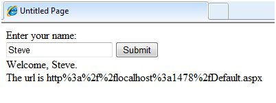

# ASP.NET – 服务器端

我们已经研究了页面生命周期和一个页面如何包含不同的控件。页面本身作为一个控制对象被实例化。所有的 web 表单基本上是 ASP.NET 页面类的实例。页面类有以下极其有用的属性，与内部对象所对应：

- 会话
- 应用程序
- 缓存
- 请求
- 响应
- 服务器
- 用户
- 跟踪

我们会在适当的时间里讨论每一个对象。在本教程中我们将会探索 Server 对象，Request 对象和 Response 对象。

## Server 对象

ASP.NET 中的服务器对象是 System.Web.HttpServerUtility 类的一个实例。The HttpServerUtility 类提供了大量的属性和方法来执行不同的工作。

### Server 对象的属性和方法

HttpServerUtility 类的方法和属性通过由 ASP.NET 提供的内部服务器对象公开的。

以下表格提供了 HttpServerUtility 类一系列的属性。

|属性|描述|
|:---|:---|
|MachineName|服务器电脑的名称|
|ScriptTimeOut|以秒为单位获取和设置请求超时的值|

以下表格提供了一些重要的方法：

|方法|描述|
|:---|:---|
|CreateObject(String)|创建一个 COM 对象的实例，由其 ProgID 验证。|
|CreateObject(Type)|创建一个 COM 对象的实例，由其 Type 验证。|
|Equals(Object)|决定具体的对象是否和现有对象一致。|
|Execute(String)|在当前请求的上下文中执行处理应用程序指定的虚拟路径。|
|Execute(String, Boolean)|在当前请求的上下文中执行处理程序指定的虚拟路径，指定是否清除 QueryString 及表单集合。|
|GetLastError|返回之前的异常。|
|GetType|获取现有实例的类型。|
|HtmlEncode|将一个普通的字符串变成合法的 HTML 字符串。|
|HtmlDecode|将一个 Html 字符串转化成一个普通的字符串。|
|ToString|返回一个表示当前对象的字符串。|
|Transfer(String)|对于当前请求，终止当前页面的执行并通过指定页面的 URL 路径，开始执行一个新页面。|
|UrlDecode|将一个 URL 字符串转化成一个普通的字符串。|
|UrlEncodeToken|与 UrlEncode 作用相同，但是在一个字节数组中，包含以 Base64 编码的数据。|
|UrlDecodeToken|与 UrlDecode 工作相同，但是在一个字节数组中，包含以 Base64 编码的数据。|
|MapPath|返回与指定的虚拟服务器上的文件路径相对应的物理路径。|
|Transfer|在当前应用程序上转移执行到另一个 web 页面。|

## Request 对象

请求对象是 System.Web.HttpRequest 类的一个实例。它代表了 HTTP 请求的值和属性，使页面加载到浏览器中。

此对象所呈现的信息被封装在更高级别的抽象中（web 控件模型）。然而，这个对象可以帮助检查一些信息，例如客户端浏览器和信息记录程序。

### Request 对象的属性和方法

下表提供了请求对象一些值得注意的属性：

|属性|描述|
|:---|:---|
|AcceptTypes|获取一个用户支持的 MIME 接受类型的字符串数组。|
|ApplicationPath|在服务器上获取 ASP.NET 应用程序的真实应用程序根路径。|
|Browser|获取或设置关于请求用户浏览器能力的信息。|
|ContentEncoding|获取或设置字符集的实体。|
|ContentLength|指定由客户端发送的内容的长度以字节为单位。|
|ContentType|获取或设置传入请求的 MIME 内容类型。|
|Cookies|获取客户端发送的 cookies 集合。|
|FilePath|获取当前请求的真实路径。|
|Files|以多部分的 MIME 格式获取客户端上传文件的集合。|
|Form	|获取表单变量的集合。|
|Headers|获取 HTTP 标题的集合。|
|HttpMethod|获取用户使用的 HTTP 数据转移方法（如 GET，POST，或者 HEAD）|
|InputStream|获取传入的 HTTP 的实体内容。|
|IsSecureConnection|获取一个值，该值指示 HTTP 连接是否使用安全套接字（即HTTPS）。|
|QueryString|获取 HTTP 询问字符串变量的集合。|
|RawUrl|获取当前请求的原始 URL。|
|RequestType|获取或设置由用户使用的 HTTP 数据转移方法（GET 或者 POST）。|
|ServerVariables|获取 Web 服务器变量的集合。|
|TotalBytes|获取现有输入流的字节数。|
|Url|获取关于现有请求的 URL 的信息。|
|UrlReferrer|获取关于与现有 URL 相链接的客户端之前的请求的 URL 信息。|
|UserAgent|获取客户端浏览器的原始用户代理字符串。|
|UserHostAddress|获取远程客户机的 IP 主机地址。|
|UserHostName|获取远程客户机的 DNS 名称。|
|UserLanguages|获取客户端语言首选项的排序字符串数组。|

下表提供了一些重要的方法：

|方法|描述|
|:---|:---|
|BinaryRead|从当前的输入流中执行一个指定字节数的二进制读数。|
|Equals(Object)|决定指定对象是否等同于现有对象。（继承自对象）|
|GetType|获取现有实例的类型。|
|MapImageCoordinates|将传入的象场表单参数绘制成适当的 x 坐标和 y 坐标值。|
|MapPath(String)|将指定的真实路径绘制成一个物理路径。|
|SaveAs|在硬盘中存为一个 HTTP 请求。|
|ToString|返回一个代表现有对象的字符串。|
|ValidateInput|导致验证发生，通过访问 Cookies，Form，QueryString 属性的集合。|

## Response 对象

响应对象代表了服务器对于用户请求的响应。它是 System.Web.HttpResponse 类的一个实例。

在 ASP.NET 中，响应对象在给用户发送 HTML 文本的过程中不扮演任何重要的角色，因为服务器端控件有嵌套的、面向对象的方法来自我呈现。

然而，HttpResponse 对象提供了一些重要的功能，比如 cookie 特点和 Redirect() 方法。 Response.Redirect() 方法允许将用户转移到另一个页面，在应用程序内部或应用程序外部均可。它需要一个往返过程。

### Response 对象的属性和方法

下表提供了一些响应对象值得注意的属性：

|属性|描述|
|:---|:---|
|Buffer|获取或设置一个值，表明是否缓冲输出，并在完整的响应程序结束后将其发送。|
|BufferOutput|获取或设置一个值，表名是否缓冲输出，并在完整页面结束进城后将其发送。|
|Charset|获取或设置输出流的 HTTP 字符集。|
|ContentEncoding|获取或设置输出流的 HTTP 字符集。|
|ContentType|获取或设置输出流的 HTTP MIME 类型。|
|Cookies|获取相应 cookie 集合。|
|Expires|获取或设置一个浏览器上缓存的页面在到期前的分钟数。|
|ExpiresAbsolute|获取或设置从缓存中移除缓存信息的绝对日期和时间。|
|HeaderEncoding|获取或设置一个编码对象，代表现有标题输出流的编码。|
|Headers|获取响应标题的集合。|
|IsClientConnected|获取一个值，表明用户是否仍和服务器相连。|
|Output|使输出的文本到输出的 HTTP 响应流。|
|OutputStream|使二进制输出到输出的 HTTP 内容本体。|
|RedirectLocation|获取或设置 Http 标题位置的值。|
|Status|设置状态栏，返回给客户端。|
|StatusCode|获取或设置返回到客户端的 HTTP 输出状态码。|
|StatusDescription|获取或设置返回给客户端的 HTTP 输出状态字符串。|
|SubStatusCode|获取或设置一个值限制响应的状态码。|
|SuppressContent|获取或设置一个值，表明是否发送 HTTP 内容到客户端。|

下表提供了一些重要的方法：

|方法|描述|
|:---|:---|
|AddHeader|给输出流添加一个 HTTP 标题。提供 AddHeader 是为了 ASP 早期版本的兼容性。|
|AppendCookie|基础设施为内部 cookie 集合添加一个 HTTP cookie。|
|AppendHeader|给输出流添加一个 HTTP 标题。|
|AppendToLog|将自定义日志信息添加到 InterNET 信息服务（IIS）日志文件。|
|BinaryWrite|将一串二进制字符写入 HTTP 输出流。|
|ClearContent|清除缓冲流中的所有内容输出。|
|Close|关闭客户端套接字。|
|End|发送所有现有的缓冲输出给客户端，停止页面执行，并且引发 EndRequest 事件。|
|Equals(Object)|确定指定对象是否等同于现有对象。|
|Flush|发送所有现有缓冲输出到客户端。|
|GetType|获取现有实例的类型。|
|Pics|将一个 HTTP PICS-Label 标题附加到输出流。|
|Redirect(String)|将请求重定向到一个新的 URL 并指定新的 URL。|
|Redirect(String, Boolean)|将客户端重定向到一个新的 URL。指定新的 URL 并且之指定现有页面是否应该终止。|
|SetCookie|在 cookie 集合中更新现存 cookie。|
|ToString|返回代表现有对象的一个字符串|
|TransmitFile(String)|直接编写指定的文件到一个 HTTP 响应输出流中，不需要在内存中缓冲。|
|Write(Char)|编写一个字符到一个 HTTP 响应输出流中。|
|Write(Object)|编写一个对象到一个 HTTP 响应流中。|
|Write(String)|编写一个字符串到一个 HTTP 响应输出流中。|
|WriteFile(String)|直接编写指定文件的内容到一个 HTTP 响应输出流中，作为一个文件块。|
|WriteFile(String, Boolean)|直接编写指定文件的内容到一个 HTTP 响应输出流中，作为一个内存块。|

## 示例

以下简单的例子有一个文本框控件，用户可以输入名称，一个按钮可以发送信息到服务器，还有一个标签控件来显示客户端计算机的 URL。

内容文件：

```
<%@ Page Language="C#" AutoEventWireup="true" CodeBehind="Default.aspx.cs" 
   Inherits="server_side._Default" %>

<!DOCTYPE html PUBLIC "-//W3C//DTD XHTML 1.0 Transitional//EN" 
   "http://www.w3.org/TR/xhtml1/DTD/xhtml1-transitional.dtd">

<html xmlns="http://www.w3.org/1999/xhtml" >

   <head runat="server">
      <title>Untitled Page</title>
   </head>
   
   <body>
      <form id="form1" runat="server">
         <div>
            
            Enter your name:
            <br />
            <asp:TextBox ID="TextBox1" runat="server"></asp:TextBox>
            <asp:Button ID="Button1" runat="server" OnClick="Button1_Click" Text="Submit" />
            <br />
            <asp:Label ID="Label1" runat="server"/>

         </div>
      </form>
   </body>
   
</html>
```

Button1_Click 点击后的代码：

```
protected void Button1_Click(object sender, EventArgs e) {

   if (!String.IsNullOrEmpty(TextBox1.Text)) {
   
      // Access the HttpServerUtility methods through
      // the intrinsic Server object.
      Label1.Text = "Welcome, " + Server.HtmlEncode(TextBox1.Text) + ". <br/> The url is " + Server.UrlEncode(Request.Url.ToString())
   }
}
```

运行页面查看以下结果：


