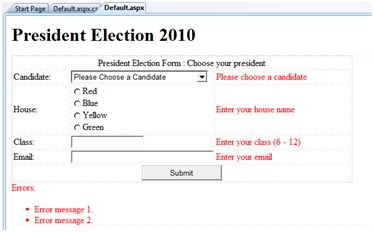

# ASP.NET - 验证器

ASP.NET 的有效性控制是验证用户输入的数据从而确保那些无用的、未经授权的、矛盾的数据不能被存储。  

ASP.NET 提供了如下几个方面的验证控制：  

- 必要字段验证器（RequiredFieldValidator）
- 范围验证器（RangeValidator）
- 比较验证器（CompareValidator）
- 正则表达式验证器（RegularExpressionValidator）
- 自定义验证器（CustomValidator）
- 验证摘要控件（ValidationSummary）  

## BaseValidator 类 

有效性验证的类从 BaseValidator 类中继承得到，因此它们继承了它的属性和方法。因此学习这个作为所有有效性控制的基础的基本类的属性和方法对于后续学习将有很大帮助：  

|**组成部分**   | **描述**         |
|:---------|:------------|
|ControlToValidate|获取或设置要验证的输入控件。|
|Display|说明错误提示如何显示。|
|EnableClientScript|说明客户端的是否采取了验证。|
|Enabled|开启或者关闭验证器。|
|ErrorMessage|说明错误字符串。|
|Text|如果验证失败将要显示的文本。|
|IsValid|说明控制值是否有效。|
|SetFocusOnError|在验证失败时是否将焦点设置到相关的输入控件上。|
|ValidationGroup|获取或设置此验证控件所属的验证组的名称。|
|Validate|对关联的输入控件执行验证并更新 IsValid 属性。|

## RequiredFieldValidator 控制 

RequiredFieldValidator 控制确保必填字段不为空。它主要和文本框绑定使得用户向文本框输入。  

该控制的语法如下：  

```
<asp:RequiredFieldValidator ID="rfvcandidate" 
   runat="server" ControlToValidate ="ddlcandidate"
   ErrorMessage="Please choose a candidate" 
   InitialValue="Please choose a candidate">
   
</asp:RequiredFieldValidator>
```  

## RangeValidator 控件 

RangeValidator 控件负责核实输入的值是否在预设的范围之内。  

它有三种特定属性：

|**属性**   | **描述**         |
|:---------|:------------|
|类型（Type）|它定义了数据类型。可用的数据类型包括：Currency, Date, <br>Double, Integer, 和 String|
|最小值（MinimumValue）|它指定了范围中的最小值|
|最大值（MaximumValue）|它指定了范围中的最大值|

这个控件的语法如下：  

```
<asp:RangeValidator ID="rvclass" runat="server" ControlToValidate="txtclass" 
   ErrorMessage="Enter your class (6 - 12)" MaximumValue="12" 
   MinimumValue="6" Type="Integer">
   
</asp:RangeValidator>
```  

## CompareValidator 控件

CompareValidator 控件根据输入到另一个输入控件中的值、常量数值或正确的数据类型来验证值。  

它有以下的特定属性：  

|**属性**   | **描述**         |
|:---------|:------------|
|Type|它定义了数据类型。|
|ControlToCompare|它指定了输入控制中需要比较的值。|
|ValueToCompare|它指定了输入控制中不变的值。|
|Operator|它指定了比较的运算符，可用的值包括：相等、不等、大于等于、小于、小于等于、数据类型检查。|  

这种控件的基本语法如下：  

```
<asp:CompareValidator ID="CompareValidator1" runat="server" 
   ErrorMessage="CompareValidator">
   
</asp:CompareValidator>
```  

## RegularExpressionValidator 控件 

RegularExpressionValidator 控件允许通过和正则表达式匹配来确定输入的有效性。正则表达式在 ValidationExpression 的属性里设置。  

下表总结了正则表达式通常所用到的语法结构：  

|**转义字符**   | **描述**         |
|:---------|:------------|
|\b|和退格键匹配。|
|\t|和 tab 匹配。|
|\r|和回车键匹配。|
|\v|和垂直制表符匹配。|
|\f|和换页符匹配。|
|\n|和换行匹配。|
|\ |转义符。|  

除了简单的字符匹配，一类字符可以被设置成匹配的，这类字符叫做通配符。  

|**通配符**   | **描述**         |
|:---------|:------------|
|.|可以匹配除了 \n 之外的任意字符。|
|[abcd]|可以匹配集合中的任意字符。|
|[^abcd]|排除集合中的任意字符。|
|[2-7a-mA-M]|匹配特定范围内的任意字符。|
|\w|匹配任意字母数字字符组和下划线。|
|\W|匹配任何非单词字符。|
|\s|匹配如空格，制表位，换行等字符。|
|\S|匹配任何非空格的字符。|
|\d|匹配任何小数字符。|
|\D|匹配任何非小数字符。|  

量词可以表明字符出现的特定字数。  

|**量词**   | **描述**         |
|:---------|:------------|
|*|零或更多匹配。|
|+|一个或更多匹配。|
|?|零或一匹配。|
|{N}|N 匹配。|
|{N,}|N 或更多匹配。|
|{N,M}|在 N 和 M 之间匹配。|  

该控件的基本语法如下：  

```  
<asp:RegularExpressionValidator ID="string" runat="server" ErrorMessage="string"
   ValidationExpression="string" ValidationGroup="string">
   
</asp:RegularExpressionValidator>
```  

## CustomValidator 控件 

CustomValidator 控件允许编写客户端和服务器端特定的验证例程来验证值。  

客户端验证通过 ClientValidationFunction 来适当的完成。客户端验证例程应该用浏览器能够识别的脚本语言来编写，例如 JavaScript 或者 VBScript。  

服务器端的验证例程应该由控件的 ServerValidate 事件处理器来生成。服务器端的验证例程应该用任意的 .Net 语言来编写，例如：C# 或 VB.Net。  

这种控件的基本语法如下：  

```
<asp:CustomValidator ID="CustomValidator1" runat="server" 
   ClientValidationFunction=.cvf_func. ErrorMessage="CustomValidator">
   
</asp:CustomValidator>
```  

## ValidationSummary 控件 

ValidationSummary 控件并不会进行任何验证但是会在页面显示一个所有的错误的总结。这个总结可以显示出所有失败的验证控件的错误信息属性的值。  

下面两个相互包含的属性列表列出来错误信息： 

- **ShowSummary**：用特殊格式显示错误信息。
- **ShowMessageBox**：用单独的窗口显示错误信息。

这个控件的基本语法如下：  

```
<asp:ValidationSummary ID="ValidationSummary1" runat="server" 
   DisplayMode = "BulletList" ShowSummary = "true" HeaderText="Errors:" />
```  

## 验证组 

复杂的页面会在不同的层面有不同的信息组。在这种情况下，不同的组就要有不同的验证这种情况可以用验证组来解决。  

创建一个验证组，你必须通过设置输入控件和验证控件的 ValidationGroup 属性从而把它们放到相同的逻辑组中。  

## 例子 

下面这个例子描述了一个将由全校学生填的表格，这个表格分为四部分是用来竞选校长的。在这里，我们将用验证控件来验证用户所输入的。 

这是在设计视图下的形式：  

  

这部分内容的代码如下：  

```
<form id="form1" runat="server">

   <table style="width: 66%;">
   
      <tr>
         <td class="style1" colspan="3" align="center">
         <asp:Label ID="lblmsg" 
            Text="President Election Form : Choose your president" 
            runat="server" />
         </td>
      </tr>

      <tr>
         <td class="style3">
            Candidate:
         </td>

         <td class="style2">
            <asp:DropDownList ID="ddlcandidate" runat="server"  style="width:239px">
               <asp:ListItem>Please Choose a Candidate</asp:ListItem>
               <asp:ListItem>M H Kabir</asp:ListItem>
               <asp:ListItem>Steve Taylor</asp:ListItem>
               <asp:ListItem>John Abraham</asp:ListItem>
               <asp:ListItem>Venus Williams</asp:ListItem>
            </asp:DropDownList>
         </td>

         <td>
            <asp:RequiredFieldValidator ID="rfvcandidate" 
               runat="server" ControlToValidate ="ddlcandidate"
               ErrorMessage="Please choose a candidate" 
               InitialValue="Please choose a candidate">
            </asp:RequiredFieldValidator>
         </td>
      </tr>

      <tr>
         <td class="style3">
            House:
         </td>

         <td class="style2">
            <asp:RadioButtonList ID="rblhouse" runat="server" RepeatLayout="Flow">
               <asp:ListItem>Red</asp:ListItem>
               <asp:ListItem>Blue</asp:ListItem>
               <asp:ListItem>Yellow</asp:ListItem>
               <asp:ListItem>Green</asp:ListItem>
            </asp:RadioButtonList>
         </td>

         <td>
            <asp:RequiredFieldValidator ID="rfvhouse" runat="server" 
               ControlToValidate="rblhouse" ErrorMessage="Enter your house name" >
            </asp:RequiredFieldValidator>
            <br />
         </td>
      </tr>

      <tr>
         <td class="style3">
            Class:
         </td>

         <td class="style2">
            <asp:TextBox ID="txtclass" runat="server"></asp:TextBox>
         </td>

         <td>
            <asp:RangeValidator ID="rvclass" 
               runat="server" ControlToValidate="txtclass" 
               ErrorMessage="Enter your class (6 - 12)" MaximumValue="12" 
               MinimumValue="6" Type="Integer">
            </asp:RangeValidator>
         </td>
      </tr>

      <tr>
         <td class="style3">
            Email:
         </td>

         <td class="style2">
            <asp:TextBox ID="txtemail" runat="server" style="width:250px">
            </asp:TextBox>
         </td>

         <td>
            <asp:RegularExpressionValidator ID="remail" runat="server" 
               ControlToValidate="txtemail" ErrorMessage="Enter your email" 
               ValidationExpression="\w+([-+.']\w+)*@\w+([-.]\w+)*\.\w+([-.]\w+)*">
            </asp:RegularExpressionValidator>
         </td>
      </tr>

      <tr>
         <td class="style3" align="center" colspan="3">
            <asp:Button ID="btnsubmit" runat="server" onclick="btnsubmit_Click" 
               style="text-align: center" Text="Submit" style="width:140px" />
         </td>
      </tr>
   </table>
   <asp:ValidationSummary ID="ValidationSummary1" runat="server" 
      DisplayMode ="BulletList" ShowSummary ="true" HeaderText="Errors:" />
</form>
```  

提交按钮的代码如下：  

```
protected void btnsubmit_Click(object sender, EventArgs e)
{
   if (Page.IsValid)
   {
      lblmsg.Text = "Thank You";
   }
   else
   {
      lblmsg.Text = "Fill up all the fields";
   }
}
```  
