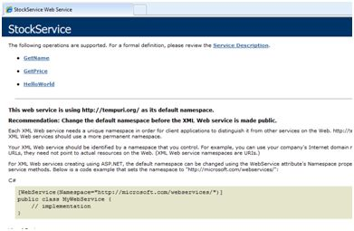
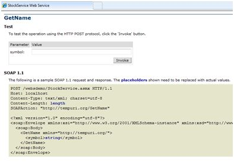
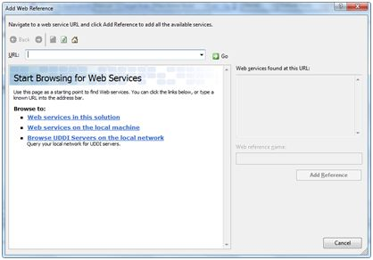
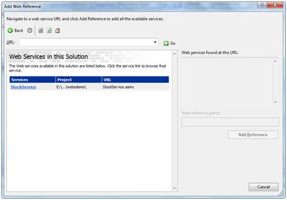
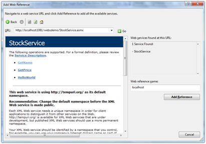

# ASP.NET - Web 服务

Web 服务是一个基于网络的功能，可被 web 应用通过 web 网络协议获取。web 服务开发主要包含以下三方面：  

- 创建 web 服务  
- 创建代理服务器  
- 使用 web 服务

## 创建 web 服务

一个 web 服务就是一个 web 应用，基本形式为一个类包含可以被其他应用调用的多个方法，它也采用隐藏代码结构例如 ASP.NET 网页，但它不存在用户接口。  

为了更好地理解这个概念让我们创建一个提供股票价格信息的 web 服务。该服务的客户端可以通过股票的标签查询相关的名字和价格。为了简化这个例子，我们设置股票价格为固定值，保存在一个二维列表中。这个 web 服务包含三个方法：
  
- 一个默认的 HelloWorld 方法  
- 一个 GetName 方法  
- 一个 GetPrice 方法  

采取以下步骤创建该服务： 
 
**步骤 (1)** : 在 Visual Studio 中选择 File -> New -> Web Site，然后选择 ASP.NET Web Service。
 
**步骤 (2)** : 一个名为 Service.asmx 的 web 服务文件和它的代码被隐藏，Service.cs 会在这个工程的 App_Code 路径下被创建。 
 
**步骤 (3)** : 将文件名修改为 StockService.asmx 和 StockService.cs。 
 
**步骤 (4)** : .asmx 文件简化了一个 WebService 指令如下：
      
```
<%@ WebService Language="C#" CodeBehind="~/App_Code/StockService.cs" 
Class="StockService" %> 
```
    
**步骤 (5)** : 打开 StockService.cs 文件，在该文件里生成的代码是 Hello World 服务的基础代码。默认的 web 服务代码如下:  

```  
    using System;
    using System.Collections;
    using System.ComponentModel;
    using System.Data;
    using System.Linq;
    
    using System.Web;
    using System.Web.Services;
    using System.Web.Services.Protocols;
    
    using System.Xml.Linq;
    
    namespace StockService
    {
       // <summary>
       // Summary description for Service1
       // <summary>
       
       [WebService(Namespace = "http://tempuri.org/")]
       [WebServiceBinding(ConformsTo = WsiProfiles.BasicProfile1_1)]
       [ToolboxItem(false)]
       
       // To allow this Web Service to be called from script, 
       // using ASP.NET AJAX, uncomment the following line. 
       // [System.Web.Script.Services.ScriptService]
       
       public class Service1 : System.Web.Services.WebService
       {
          [WebMethod]
      
          public string HelloWorld()
          {
             return "Hello World";
          }
       }
    }
```

 **步骤 (6)** : 修改文件内的代码增加一个存储了各股票标签，名称和价格的字符串的二维指针，并编写获取股票信息的两个 web 方法如下；  

 ```
    using System;
    using System.Linq;
    
    using System.Web;
    using System.Web.Services;
    using System.Web.Services.Protocols;
    
    using System.Xml.Linq;
    
    [WebService(Namespace = "http://tempuri.org/")]
    [WebServiceBinding(ConformsTo = WsiProfiles.BasicProfile1_1)]
    
    // To allow this Web Service to be called from script, 
    // using ASP.NET AJAX, uncomment the following line. 
    // [System.Web.Script.Services.ScriptService]
    
    public class StockService : System.Web.Services.WebService
    {
       public StockService () {
      //Uncomment the following if using designed components 
      //InitializeComponent(); 
       }
       
       string[,] stocks =
       {
          {"RELIND", "Reliance Industries", "1060.15"},
          {"ICICI", "ICICI Bank", "911.55"},
          {"JSW", "JSW Steel", "1201.25"},
          {"WIPRO", "Wipro Limited", "1194.65"},
          {"SATYAM", "Satyam Computers", "91.10"}
       };
    
      [WebMethod]
       public string HelloWorld() {
          return "Hello World";
       }
       
      [WebMethod]
       public double GetPrice(string symbol)
       { 
          //it takes the symbol as parameter and returns price
          for (int i = 0; i < stocks.GetLength(0); i++)
          {
             if (String.Compare(symbol, stocks[i, 0], true) == 0)
             return Convert.ToDouble(stocks[i, 2]);
          }
      
          return 0;
       }
       
       [WebMethod]
       public string GetName(string symbol)
       {
          // It takes the symbol as parameter and 
          // returns name of the stock
          for (int i = 0; i < stocks.GetLength(0); i++)
          {
             if (String.Compare(symbol, stocks[i, 0], true) == 0)
             return stocks[i, 1];
          }
      
          return "Stock Not Found";
       }
    }
```

**步骤 (7)** : 运行 web 服务应用给出了一个 web 服务测试页面，我们可以在该页面测试服务方法。
  
  

**步骤 (8)** : 点击一个方法名字，确认它是否在正确运行。  



**步骤 (9)** : 为检测 GetName 方法，提供已经被定义的股票标签中的一个，正确的话会返回相关股票的名称。


## 使用 Web 服务

为使用该 web 服务，我们在相同的解决方案(Solution)下创建一个网站，只需在解决方案管理器上右击该解决方案名字即可，web 服务调用的网页应具有一个控制管理以显示返回的结果和两个控制按钮，一个用于返回另一个用于开始调用服务。
  
web 应用的文件内容如下：  

```
    <%@ Page Language="C#" AutoEventWireup="true" CodeBehind="Default.aspx.cs" Inherits="wsclient._Default" %>
    
    <!DOCTYPE html PUBLIC "-//W3C//DTD XHTML 1.0 Transitional//EN" "http://www.w3.org/TR/xhtml1/DTD/xhtml1-transitional.dtd">
    
    <html xmlns="http://www.w3.org/1999/xhtml" >
    
       <head runat="server">
          <title>
             Untitled Page
          </title>
       </head>
       
       <body>
       
          <form id="form1" runat="server">
             <div>
     
                 <h3>Using the Stock Service</h3>
    
                 <br /> <br />
    
                 <asp:Label ID="lblmessage" runat="server"></asp:Label>
    
                 <br /> <br />
    
                 <asp:Button ID="btnpostback" runat="server" onclick="Button1_Click" Text="Post Back" style="width:132px" />
       
                 <asp:Button ID="btnservice" runat="server" onclick="btnservice_Click"  Text="Get Stock" style="width:99px" />
    
              </div>
          </form>
      
       </body>
    </html>
```

web 应用的代码如下：

```
    using System;
    using System.Collections;
    using System.Configuration;
    using System.Data;
    using System.Linq;
    
    using System.Web;
    using System.Web.Security;
    using System.Web.UI;
    using System.Web.UI.HtmlControls;
    using System.Web.UI.WebControls;
    using System.Web.UI.WebControls.WebParts;
    
    using System.Xml.Linq;
    
    //this is the proxy
    using localhost;
    
    namespace wsclient
    {
       public partial class _Default : System.Web.UI.Page
       {
           protected void Page_Load(object sender, EventArgs e)
           {
               if (!IsPostBack)
               {
                   lblmessage.Text = "First Loading Time: " +  DateTime.Now.ToLongTimeString
               }
               else
               {
                   lblmessage.Text = "PostBack at: " + DateTime.Now.ToLongTimeString();
               }
           }
      
           protected void btnservice_Click(object sender, EventArgs e)
           {
               StockService proxy = new StockService();
               lblmessage.Text = String.Format("Current SATYAM Price:{0}",
               proxy.GetPrice("SATYAM").ToString());
           }
      }
    }
```

## 创建代理服务器

代理服务器指的是一个 web 服务代码的代替者。在使用 web 服务之前，我们必须创建一个代理服务器。这个代理服务器是由客户端应用注册的。然后客户端应用实现调用 web 服务使之像在使用一个本地方法一样。  

该代理服务器将调用，并用适当的格式将调用像发送 SOAP 请求一样发送到服务器。SOAP 支持简单对象访问协议（Simple Object Access Protocol）。该协议适用于 web 服务数据交换。
  
当此服务器响应并返回一个 SOAP 包给客户端时，代理服务器将一切呈现给客户端应用程序。
  
使用 btnservice_click 调用 Web 服务之前，Web 应用应该被添加到应用程序。这将透明地创建一个代理类，可由 btnservice_click 事件使用。

```
    protected void btnservice_Click(object sender, EventArgs e)
    {
       StockService proxy = new StockService();
       lblmessage.Text = String.Format("Current SATYAM Price: {0}", 
       proxy.GetPrice("SATYAM").ToString());
    }
```

采取以下步骤创建代理：  
  
**步骤 (1)** : 在解决方案管理器（SolutionExplorer）的 web 应用入口处右击选择 ‘Add Web Reference’。  



**步骤 (2)** : 选择 ‘Web Services in this solution’，会返回我们编写的股票服务引用。

  

**步骤 (3)** : 点击该服务打开测试页面，创建代理时默认为 ‘localhost’，当然你也可以进行重命名。点击 ‘Add Reference’ 来实现向客户端应用程序添加一个代理。 
 
  

在代码中加入以下语句使之包含该代理：  

```
using localhost;
```
